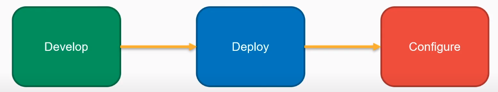
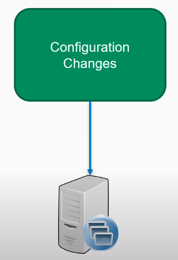
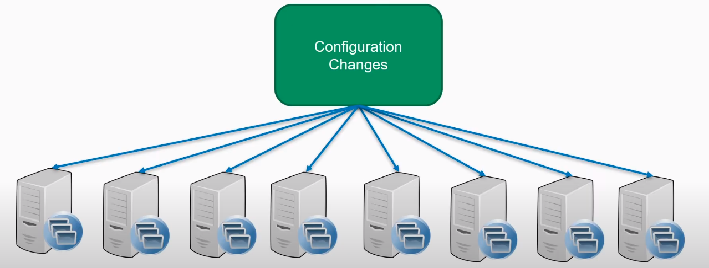
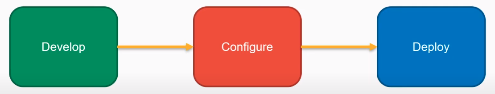
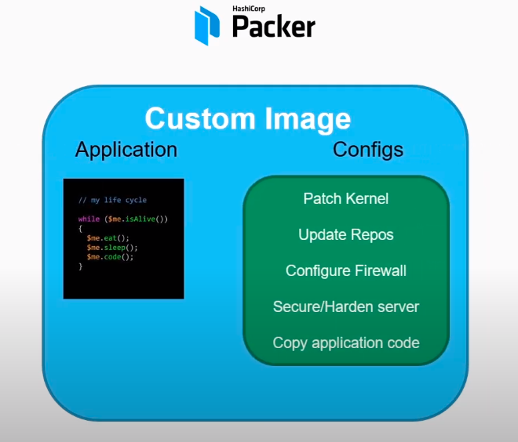
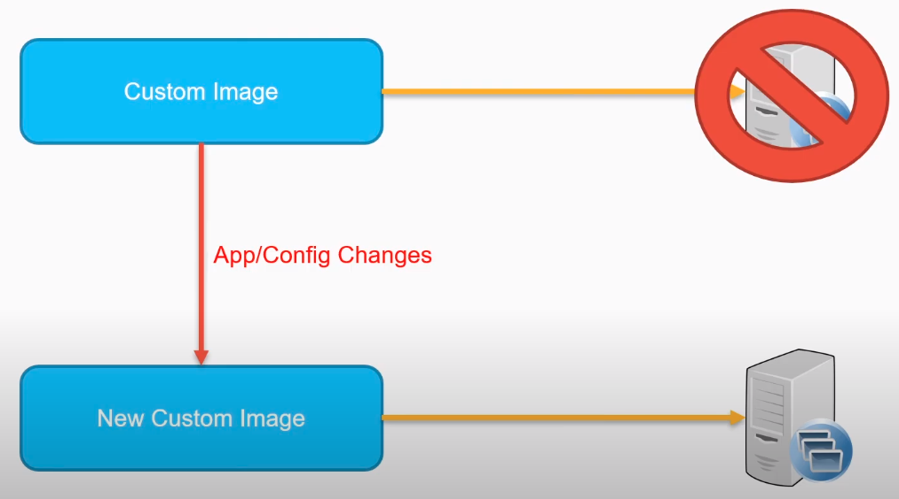
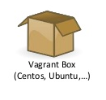

# Packer

## índice 
1. [¿Qué es Packer?](#id1)  
2. [¿Para que sirve?](#id2)  
   2.1. [Infraestructura Mutable](#id2-1)  
   2.2. [Infraestructura Inmutable](#id2-2)  
3. [Builders](#id3)  
4. [Provisioners](#id4)  

## 1. ¿Qué es Packer?

**Packer** es una herramienta que nos permite crear imágenes customizadas a través de múltiples plataformas que son llamadas **Builders**.

## 2. ¿Para qué sirve?

Si echamos un vistazo al marketplace de **AWS** veremos que tenemos miles de amis customizadas ya creadas y es muy probable que alguna tenga lo que nostros necesitamos, entonces, ¿para que necesitamos customizar nuestra propia imagen?.

Bueno para responder esa duda tendemos que explicar qué es una infraestructra mutable y qué es una infraestructra inmutable.

### 2.1. Infraestructura Mutable

Cuando queremos desplegar nuestra infraestructura, digamos que queremos crear un servidor web, siguiendo la manera de deplegamiento tradicional, lo primero que hacemos es crear el código para nuestra aplicación, una vez terminada la aplicación pasamos a la fase de desplegamiento, en esta fase desplegamos el servidor, en **AWS** por ejemplo, este servidor va a necesitar tener un sistema operativo que tendremos que instalar. 

Hasta este punto nuestro servidor no está listo aún ya que faltan hacer unas configuraciones, aquí es cuando nos mevemos a la fase de configuración como por ejemplo, actualizar e instalar todos los repositorios necesarios, configrar el firewall para que, en el caso del servidor, podamos permitir el tráfico de puerto http(80) y https(443), etc.

Este proceso es lo que se llama una infraestructura mutable ya que despues de haber desplegado nuestro servidor lo estamos mutando o cambiando instalando los repositorios, configurando el firewall, etc. 

Este método es viable cuando solo tienes pocos servidores que desplegar.

El problema viene cuando tenemos muchos servidores que desplegar, entonces tendríamos que ir uno a uno configurando los servidores. 

Para este problema la solución que la mayoría de personas acude es usar Herramientas de la configuración como **Ansible** que se hará cargo de que todos los servidores que han sido desplegados tengas la configuración necesaria. 

Una de las soluciones, que es muy utilizado, es el uso de **Herramientas de la configuración** que se encargarán de hacer llegar las configuraciones e instalciones a cada servidor.

Una de estas herramientas es [Ansible](https://www.ansible.com/)

### 2.2. Infraestructra Inmutable

Otra de las soluciones es usar la infraestructura inmutable:

Digamos que en lugar de primero hacer el deploy y luego aplicar los cambios y configuraciones del servidor, primero hacemos la configuración y luego hacemos el deploy:

Bien pues aquí es cuando la herramienta **Packer** tiene importancia ya que podemos juntar la parte de la creación de código de nuestra aplicación y la parte de la configuración en una imagen customizada:

Por lo tanto nuestra imagen ya tiene todo el código de la aplicación y todas la configuraciones necesarias y solo quedaría desplegar y estaría lista para funcionar. 

En caso de tengamos que añadir, cambiar el código de nuestra aplicación, cambiar o añadir configuraciones lo único que tendrímos que hacer es crear otra imagen custumoizada a partir de la anterior con todos lo cambiamos hecho, eliminar el despliegue del servidor con la imagen antigua y volver a lanzar el servidor de nuevo pero con la imagen nueva.

## 3. Builders

La función de los **builders** es crear una máquina y generar una imagen para la plataforma que el builder pertenezca, por ejemplo **AWS** con las ***instances*** y **Vagrant** con las ***boxes***.

## 4. Provisioners

Es donde podemos confiugrar e instalar nuestra imagen, por ejemplo instalar paquetes, crear usuarios, hacer la configuraciones necesarias, etc.