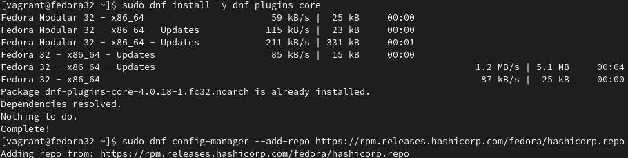
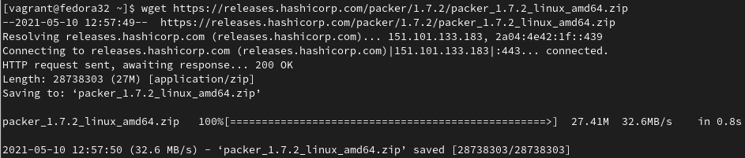
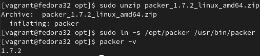
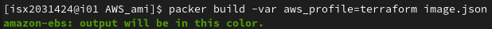
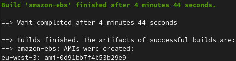
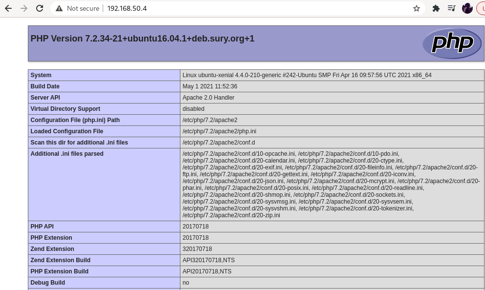
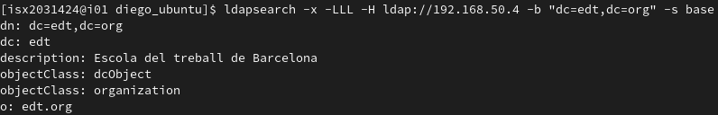

# Procedimiento

## Índice

1. [Idea Principal](#id1)  
2. [Instalación](#id2)  
3. [AWS ami](#id3)  
4. [Vagrant Box](#id4)  
5. [Conclusiones](#id5)  
6. [Bibliografia](#id6)  

<a name="id1"></a>
## 1. Idea Principal

La idea principal de este documento es demostrar la instalación de Packer así como la creación de una imagen  customizada ami para **AWS** y un box customizado para **Vagrant**.

<a name="id2"></a>
## 2. Instalación

La instalación es muy sencilla, solo hace falta añadir el repositorio y ya estaría listo para usar.



Una vez añadido el repositorio solo quedaría hacer un ```dnf -y install packer```.

Tambíen podemos hacerlo descargando el binario:





<a name="id3"></a>
## 3. AWS ami

Esta ami customizada tendrá **apache2** y **php** instalados y configurados para que al momento de acceder al servidor apache nos muestre información de php.

Esta instalación y configuración se harán por medio del provisioner **"shell"** y se la pasará el fichero *index.html* por medio del provisioner **"file"**.

Esta ami customizada tendrá de base una ami del market de **AWS** que tiene de base un sistema operativo *Ubuntu Server 20.04 LTS*.

**install.sh:**

```
#!/bin/bash
sleep 30
sudo apt update
sudo apt -y install apache2
sudo apt -y install software-properties-common
sudo add-apt-repository ppa:ondrej/php
sudo apt -y install php7.4

sudo rm -f /var/www/html/index.html

sudo systemctl start apache2.service
```

**index.php:**

```
<?php
phpinfo();
?>
```

**image.json:**

```
{
    "builders": [
        {
            "typem": "amazon-ebs",
            "profile": "{{ user `aws_profile` }}",
            "region": "eu-west-3",
            "ami_name": "diego_ami",
            "source_ami": "ami-0f7cd40eac2214b37",
            "instance_type": "t2.micro",
            "ssh_username": "ubuntu"
        }
    ],
    "provisionaer": [
        {
            "type": "shell",
            "script": "intall.sh"
        },
        {
            "type": "file",
            "source": "index.php",
            "destination": "/tmp/"
        },
        {
            "type": "shell",
            "inline": ["sudo cp /tmp/index.php /var/www/html/"]
        }
    ]
}
```
* **Builders:**
  
  * Primero le indicamos que **Builder** queremos usar, en este caso el de **AWS** concretamente para crear amis para instancias EC2.
  * El profile se lo pasaremos como argumento por tal de aprovechar el CLI de AWS donde tenemos alamcenados nuestras **acces key** y **secret key**.
  * Le indicamos también la región donde usareme **AWS**.
  * El nombre que tendrá la ami que crearemos.
  * Es necesario que le indiquemos una **source_ami** ya que lo que hará **Packer** será copiar una ami base de referencia y en esta copia aplicar los cambios que hayamos especifado.
  * También es necesario indicar el **instance_type** ya que **Packer** para que pueda crear la imagen customizada primero tiene que lanzar un instancia y en esa instancia aplicar todas las configuraciones que hayamos espcificado, luego destruirá esta instancia y generará la imagen.
  * El **ssh_unsername** es para que **Packer** al momento de crear la instancia se pueda conectar a esta, es te caso es *"ubuntu"* ya que estamos usando la ami de un S.O. ubuntu y estos en **AWS** cuentan con el usuari ubuntu para poder conectarse.

*  **provisioners:**
   *  Usaremos dos tipos de provisioners:  
      *  <u>shell:</u> Este provisioner nos permite ejecutar comandos de shell, en el cual le pasaremos un fichero .sh el cual contiene la instalación de apache2 y php además de una pequeña configuración.
      *  <u>file:</u> Es el cual nos permite tranferir ficheros de la máquina host al host remoto donde se lanzará la instancia, en este caso en concreto le estamos pasando un fichero de nombre *"index.php"* que contiene una función que muestra información sobre el módulo php ```phpinfo()```.

***Cabe resaltar que primero tranferimos el fichero index.php a /tmp/ ya que el provisioner file no cuenta con permisos de root ni está en el grupo de sudoers y por lo tanto no tiene persmiso de tranferir directamente el fichero a /var/www/html/. Entonces lo que hemos hecho es primero pasarlo a /tmp/ dónde todo el mundo tiene permisos tanto de escritura como de lectura y luego con comandos de shell lo copiamos a /var/www/html***

Una vez todos los ficheros están preparados queda hacer un ```packer build -var aws_profile=terraform``` donde al argumento **-var** le pasamos la variable **aws_profile** con el valor *terraform* que es el perfil que contiene las credenciales (**aws_access_key_id** y **aws_secret_access_key**) para poder acceder y gestionar los recursos de **AWS**.



Podremos que comprobar en este ***output*** el proceso que hace **Packer** para poder crear la imagen customizada.

Lo que hace es lanzar una instancia con la ami base especificada en el fichero ***imagen.json*** creando una key_pair y security group que permite el acceso por medio del puerto 22 (SSH) para que así **Packer** pueda hacer las instalaciones y configuraciones que hayamos especificado (en este caso la instalación y configuración de apache y php) por medio de los provisioners **shell** y **file**.



Una vez hecho este proceso, si nos dirigimos a **AWS** y buscamos en el apartado de *AMIs* podremos ver que nuestra ami ha sido creada:


Lo podemos comprobar fijandonos que la **ami ID** coincide con el output que ha mostrado **Packer** al momento de crear la imagen.

<a name="id4"></a>
## 4. Vagrant Box

Este box customizado partirá de un box con una imagen de [ubuntu/xenial64](https://app.vagrantup.com/ubuntu/boxes/xenial64/versions/20210429.0.0) que tendrá instalados y configurados apache, php y ldap.

**install.sh:**
```
#!/bin/bash
sudo sleep 30
# Update Packages
sudo apt-get update
# Upgrade Packages
sudo apt-get upgrade

# Basic Linux Stuff
sudo apt-get install -y git

# Apache
sudo apt-get install -y apache2

# Enable Apache Mods
sudo a2enmod rewrite

#Add Onrej PPA Repo
sudo apt-add-repository ppa:ondrej/php -y
sudo apt-get update

# Install PHP
sudo apt-get install -y php7.2

# PHP Apache Mod
sudo apt-get install -y libapache2-mod-php7.2

# Restart Apache
sudo service apache2 restart

# PHP Mods
sudo apt-get install -y php7.2-common
sudo apt-get install -y php7.2-mcrypt
sudo apt-get install -y php7.2-zip

# set slapd pass
sudo debconf-set-selections <<< 'slapd slapd/root_password password jupiter'
sudo debconf-set-selections <<< 'slapd slapd/root_password_again password jupiter'

# install ldap moduls
sudo DEBIAN_FRONTEND=noninteractive apt-get -y install slapd
sudo apt-get install -y ldap-utils

# configure ldap
sudo rm -rf /etc/ldap/slapd.d/*
sudo rm -rf /var/lib/ldap/*
sudo cp /home/vagrant/ldap/DB_CONFIG /var/lib/ldap/.
sudo slaptest -Q -f /home/vagrant/ldap/slapd.conf -F /etc/ldap/slapd.d &> /dev/null
sudo slapadd -F /etc/ldap/slapd.d -l /home/vagrant/ldap/edt.org.ldif
sudo chown -R openldap.openldap /etc/ldap/slapd.d
sudo chown -R openldap.openldap /var/lib/ldap
sudo cp /home/vagrant/ldap/ldap.conf /etc/ldap/ldap.conf
sudo service slapd start
sudo service slapd restart
```

**index.php:**
```
<?php
phpinfo();
?>
```
**image.json:**

```
{
    "builders": [
      {
        "communicator": "ssh",
        "source_path": "ubuntu/xenial64",
        "provider": "virtualbox",
        "type": "vagrant"
      }
    ],
    "provisioners": [
        {
            "type": "file",
            "source": "ldap",
            "destination": "~/"
        },
        {
          "type": "file",
          "source": "index.php",
          "destination": "~/"
        },
        {
            "type": "shell",
            "script": "install.sh"
        }
    ]
}
```

Todos los ficheros necesarios para la configuración de **ldap** que está especificada en el fichero **install.sh** se encuentran en un directorio de nombre "ldap" que a su vez se encuentra en el mismo directorio donde está el fichero de **image.json** y que, por lo tanto, es de donde se hará el ```packer build```.

Lo que hará **Packer** será lanzar un box base, en este cabo ubuntu/xenial64 que, concretamente, contiene la imagen ubuntu 16.04 LTS, y conectarse por ssh.

Una vez lanzada empieza a hacer las configurciones de los diferentes **provisioners** que hayamos especificado, luego que se haya configurado e/o instalado todo correctamente crea la imagen y la empaqueta en un **box**.

Cuando haya acabado todo este proceso hace un ```vagrant destroy``` del box base.

* **builders:**
  * communicator: Como se comunicará packer con el box de vagrant.
  * source_path: La ruta en la cual obtiene el box (puede ser de la Vagrant Cloud, de una URL, o de un box local).
  * provider: Que provider en concreto usará el box para poder ser lanzado, en este caso virtualbox.
  * type: El tipo de imagen, en este caso box por ser de **Vagrant**.
* **provisioners:**
  * file: Nos permite tranferir elementos desde la máquina real al box creado temporalmente.
  * shell: Nos permite ejecutar comando de shell *"inline"* o como un fichero de *"script"* en el box lanzado temporalmente.
  
Una vez tenemos todo configurado, hacemos ```packer build image.json``` y nos empezará a crear el box.

Una vez creado el box customizado tenemos que añadirlo a **Vagrant** con el comando ```vagrant box add output-vagrant/package.box --name diego/ubuntu``` siendo **output-vagrant/** el directorio donde se encuentra el box customizado.

***El argumento ```--name``` es obligatorio cuando añadimos un box que no se encuentra en el cloud de Vagrant***

Creamos un fichero **Vagrantfile** diciendole las configuraciones que necesitemos:

**Ejemplo Vagrantfile:**

```
Vagrant.configure("2") do |config|
  config.vm.box = "diego/ubuntu"
  config.vm.network "forwarded_port", guest: 80, host: 8080
  config.vm.network "forwarded_port", guest: 386, host: 3386
  config.vm.network "private_network", ip: "192.168.50.4"
  config.vm.provider "virtualbox" do |vb|
  end
end
```

Hacemos un ```vagrant up``` y comprovamos que todo funciona correctamente:





<a name="id5"></a>
## 5. Conclusiones

Con packer he descubierto los dos tipos de infraestructura que son la mutable y la inmutable, de las cuales me he centrado en la infraestructura imnutable ya que es la solución que da **Packer** ante el problema explicado en la introducción.

Y podemos usar esta ami customizada ,que ya cuenta con la instalación y configuración de apache y php, en AWS para desplegar la infraestructura y nos ahorramos tener que acudir a un aprovisionador para realizar esta instalación y configuración. También pasaría con **Vagrant** y la box customizada.

<a name="id6"></a>
## 6. Bibliografia

https://www.packer.io/docs

https://www.packer.io/

https://github.com/hashicorp/packer

https://openwebinars.net/