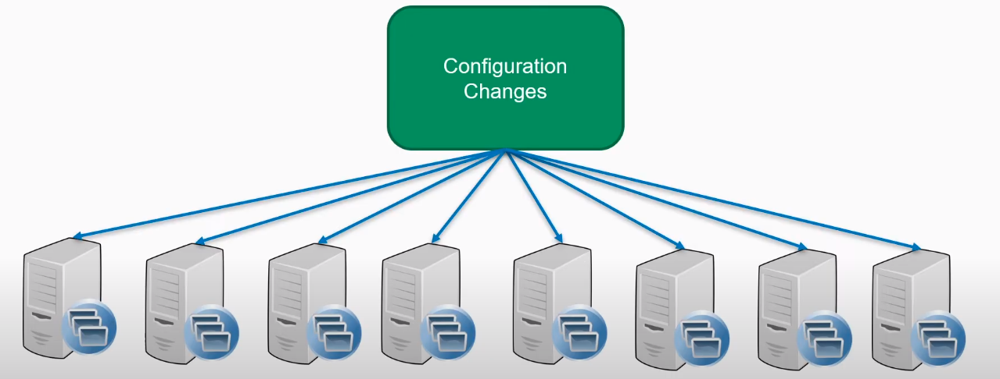

% Vagrant

# Lenguaje Declarativo:

<!-- -->

# ¿Qué es Vagrant?:

<!--   -->

# Arquitectura:
  
<!--   -->

# Portabilidad:
  
<!--   -->

# Ejercicio Final:
  
<!--   -->

% Terraform

# Infraestructura como Código:

<!--   -->

# ¿Qué es Terraform?:

<!--   -->

# Utilidad:

<!--    -->

<!--   -->

# Workflow:

<!--   -->

# Funcionamiento:

<!-- -->

# Ejercicio Final:

<!-- -->

% Packer

# ¿Qué es Packer?:

# Infraestructura Mutable:

 

 

*  Problema:

   

*  Solución:
  
 

# Infraestructura Inmutable:

 

 

# Ejercicios Finales:
  * Terraform:
     
  * Vagrant:
     
