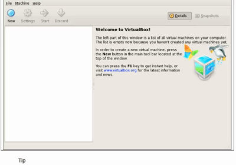
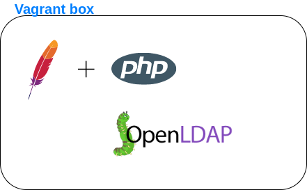

---
title: presentacion proyecto edt
author: Diego Sanchez
date: "2021-05-10"
---  
# Vagrant
## Lenguaje Declarativo:

## ¿Qué es Vagrant?:

## Arquitectura y Funcionamiento:

## Portabilidad:

## Ejercicio Final:

# Terraform
## Infraestructura como Código:

 

## ¿Qué es Terraform?:

 

## Utilidad:

## Workflow:

## Funcionamiento:

## Ejercicio Final:

# Packer
## Infraestructura Mutable:

##  Problema:

## Infraestructura Inmutable:

## ¿Qué es Packer?

## Ejercicios Finales:  

AWS ami:  

Vagrant box:  

