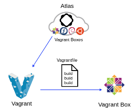
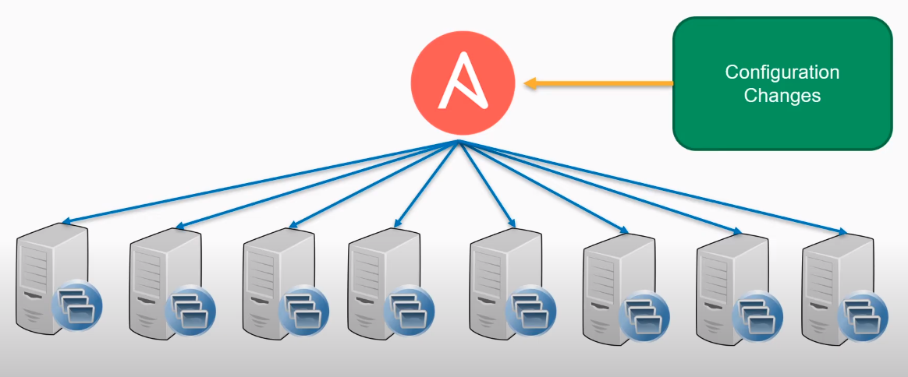
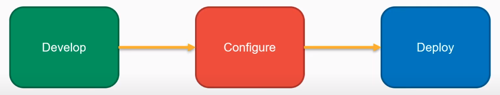

# Vagrant

# Lenguaje Declarativo:

# ¿Qué es Vagrant?:

# Arquitectura:

# Portabilidad:

# Ejercicio Final:

# Terraform

# Infraestructura como Código:

# ¿Qué es Terraform?:

# Utilidad:

# Workflow:

# Funcionamiento:

# Ejercicio Final:

% Packer

# ¿Qué es Packer?:

# Infraestructura Mutable:

*  Problema:

   

*  Solución:
  
 

# Infraestructura Inmutable:

 

 

# Ejercicios Finales:
  * Terraform:  
  
     

  * Vagrant:  
  
     
