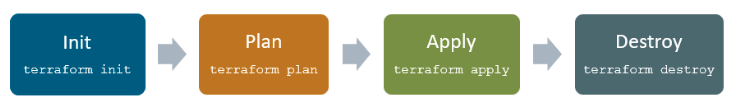
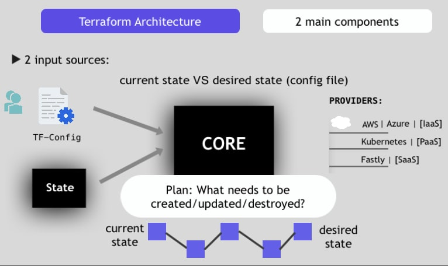
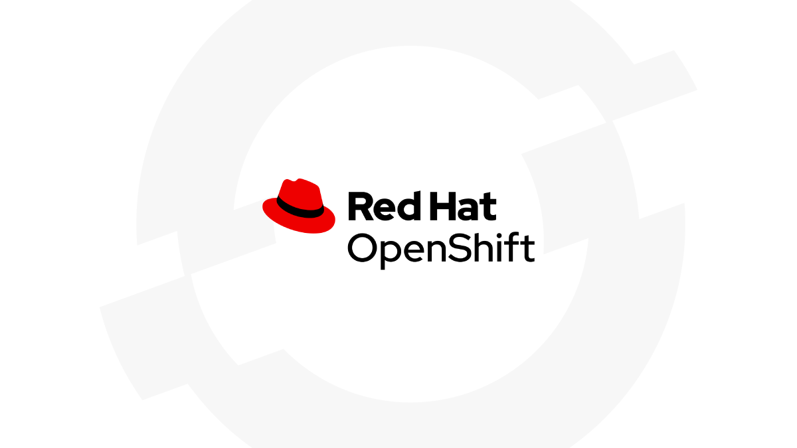
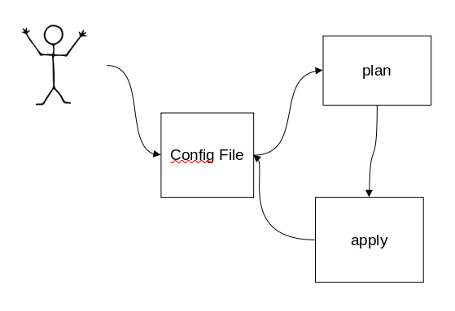
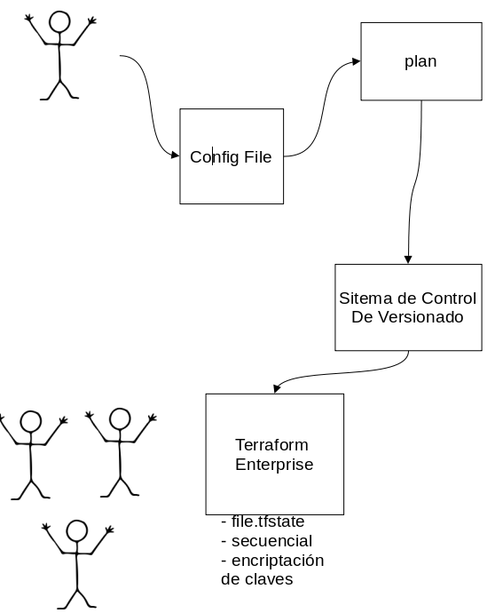

# Terraform

## Índice

1. [Infraestructura como código (IaC)](#id1)   
2. [¿Qué es Terraform?](#id2)  
   2.1. [Lenguaje Declarativo](#id21)  
   2.2. [Funcionamiento](#id22)    
3. [Arquitectura](#id3)  
   3.1. [Terraform Core](#id31)  
   3.2. [Proveedoers](#id32)
4. [Terraform en equipo](#id4)

<a name="id1"></a>
## 1. Infraestrutura como código (IaC)

<br>

Imaginemos que tenemos nuestra aplicación y la queremos desplegar, para ello necesitaremos un servidor y en este servidor realizar las configuraciones e instalaciones pertinentes para que nuestra aplicación pueda funcionar correctamente, antiguamente todo este proceso se hacia de forma manual, esto tomaba mucho tiempo y si a esto sumanos los posibles errores humanos y la falta de control sobre los cambios realizados en la arquitectura, estamos aumentando potencialmente las probabilidades de que algo pueda salir mal.

Con la **Infraestructura como Código**, por medio de código, conseguimos la automatización de todos estos pasos de preparción del ámbito donde queremos desplegar nuestra aplicación.

Por lo tanto puede adaptarse, utilizarse es un sistema de control de código (git), puede versionarse, etc.

Existen varias herramientas para realizar este método, y una de las ellas es **Terraform**.

<a name="id2"></a>
## 2. ¿Qué es Terraform?

<br> 

Terraform define la estructura mediante ficheros de configuración, con estos ficheros podemos definir partes del sistema o incluso el sistema completo, luego **Terraform** se encargará de generar un plan de ejecución que termine con la infraestructura con el estado definido en estos ficheros. 

<a name="id21"></a>
### 2.1. Lenguaje Declarativo  

<br>

Una configuración declarativa quiere decir que nosotros le indicamos el objetivo al que queremos llegar, un ejemplo sería en caso de que queramos llegar de un punto A a un punto B conduciendo nosotros un coche tenemos que seguir indicacación a indicación hasta llegar al destino, en cambio si pedimos un taxi solo le tenemos que decir a dónde queremos llegar, es decir solo hace falta indicarle la finalidad.

<a name="id22"></a>
### 2.2. Funcionamiento  

Terraform tiene un ciclo de vida bastante simple que se basa en:  

  

* **terraform init:**
  ```terraform init``` es el punto de partida para empezar a usar **terraform** ya que inicializa el directorio de trabajo, donde se encuentran los distintos archivos de confiuración, cargando todos los módulos y recursos que estos ficheron necesiten.
* **terraform plan:**
  ```terraform plan``` lo que hace es crear una plan de la configuración que hemos especificado sin aplicar ningún cambio, solo nos muestra al punto al que queremos llegar, es decir, el ***desired state*** de nuestra infraestructura.
* **terraform apply:**
  ```terraform apply``` una vez estemos de acuerdo con el plan que nos muestra **terraform** con el plan de la orden anterior, ejecutamos está orden por tal de aplicar los cambios o creación que queremos hacer para por fin llegar al ***desired state***
* **terraform destroy:**
  En caso de ya no necesitemos está infraestructura o esta solo haya sido para hacer pruebas y ya hayamos acabado y estemos listos para poder desplegarla en el "mundo real" podemos usar ```terraform destroy``` para borrar toda la configuración hecha, al final está orden es una versión "especial" de ```terraform plan``` y ```terraform apply``` ya que lo que hace es crear un plan de eliminación de la configuración hecho y aplica este plan. 

<a name="id3"></a>
## 3. Arquitectura

  

Como se puede ver en la imagen, **terraform** se compone de dos componentes que conforman su arquitectura de funcionamiento:  

* Terraform Core
* Proveedores
  
<a name="id31"></a>
### 3.1. Terraform Core  

Este componente es responsable de 2 elementos principales:

* **Terraform Configuration:**
  Este elemento es la o las configuraciones definidas por el usuario.

* **Terraform.tfstate:**
  Y este otro elemento es "el punto de vista de terraform del mundo exterior", es decir, en caso de que ya tengamos una infraestructura creada, aquí es donde se guarda esta y por lo tanto **terraform** puede saber, por medio de este fichero, que cambios tiene que hacer en la infraestructura.

  Aquí es donde **terraform** se mantiene al día sobre la infraestructura.

<a name="id32"></a>
### 3.2. Proveedores  

Los proveedores vienen a ser como **terraform** se conecta al munto exterior, estos proveedores pueden ser **IaaS** (Infraestructure as a Service), **PaaS** (Platform as a Service) o **SaaS** (Software as a Service).

* **Iaas:**
  En esta modalidad el proveedor se encarga de proporcionar todo el hardware necesario para poder administrar nuestra infraestructura, es decir nosotros nos encargamos de todas la configuraciones de nuestra infraestructura, por ejemplo el sistema operativo, las aplicaciones necesarias, etc.

  Algunas de las empresas que proporcionan estos servicios son:

  <br>

  

* **PaaS:**
  Aquí el proveedor proporciona un sistame completamente en funcionamiento con la infraestructura ya configurada, por ejemplo en caso de seamos desarrolladores y necesitemos programar tendríamos todo ya instalado y configurado para poder centrarnos en programar.

  <br>

  
* **Saas:**
Y los mas importante es que **terraform** puede unificar estos 3 servicios para que trabajen juntos en una misma infraestrucutra, por ejemplo en uns infraestructura queremos tener una infraestructura en **AWS**, en esta implementar **Kubernetes** y luego añadir servicios dentro del clúster de **Kubernetes**.

Terraform cuenta con más de 100 proveedores y estos pueden, individualmente, gestionar miles de recursos que tiene cada uno de ellos.

<a name="id4"></a>
## 3. Terraform en equipo

Como una única persona lo normal para ella sería seguir el mismo ciclo de funcionamiento creando el fichero de configuración, haciendo ```terraform plan``` y finalmente ```terraform apply``` y así en bucle.

 

Pero ¿Cómo hacemos si queremos trabajar com más personas, es decir en un equipo, y queremos tener una visión de cual es la configuración y evitar que los cambios de cada persona se ejecuten de forma paralela y se solapen entre ellos?

**Terraform** tiene una solución que es muy similar al funcionamiento de **GIT** como equipo, usando **Github** por ejemeplo, la equivalencia que usa **terraform** es ***Terraform Enterprise***. 

* **funcionamiento:**
  Una vez una persona haya hecho una configuración y un plan, y en vez de hacer el apply localmente lo que se hace es un push a un sistema de versionado, que puede ser Github por ejemplo, luego de hacer el push esto va a la aplicación de ***Terraform Enterprise*** donde se guarda el fichero **terraform.tfstate** que es lo que nos mantiene al día sobre cual es el estado actual de la infraestructura, también se asegura de que solo se ejecuta una configuración a la vez y por lo tanto soluciona que las múltiples configuraciones se solapen, otro posible problema es el tráfico de variables locales que contienen credenciales o claves, como por ejemplo las credenciales de AWS para este problema **terraform** se encarga de hacer un tráfico seguro de estas claves por lo tanto estas no se pueden filtrar por el exterior.

