# Procedimiento

## Índice
1. [Instalación](#id1)  
2. [Providers](#id2)  
   1.1. [AWS Provider](#id2-1)  
3. [Configuración Simple](#id3)  
   3.1. [Creación de un recurso](#id3-1)  
   3.2. [Fichero de estado](#id3-2)  
   3.3. [Varibales](#id3-3)  
   3.4. [Outputs y Recurso Instancias](#id3-4)  
   3.5. [Templates](#id3-5)  
4. [Configuración Compleja](#id4)  
   4.1. [Múltiples Recursos](#id4-1)  
   4.2. [Reutilizar Plantilla](#id4-2)  
   4.3. [Relacionar Recursos](#id4-3)  
5. [Ejercicio Final](#id5)  

<a name="id1"></a>
### 1. Instalación  

La instalación de Terraform un muy sencilla, para poder instalarlo tenemos que descargar un archivo comprimdo que contiene el binario de **Terraform** de la la página de [Terraform](https://www.terraform.io/downloads.html), ahí encontraremos las diferentes opciones para los diferentes sistemas operativos y distribuciones disponibles como MacOS,FreeBSD, Linux, OpenBSD, Solaris, Windows, también encontramos opciones a la arquitectura, ya sea 32-bits, 64-bits, Arm o Arm64.

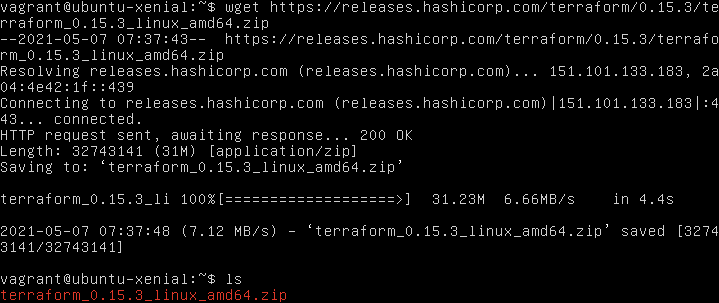  

Para este caso descargamos el comprimido .zip para una máquina de distribución Linux de 64-bits.

Lo descomprimimos y lo vemos a al directorio /usr/bin/ para poder ejecutarlo desde cualquier lugar:

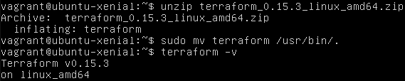  

y listo, ya estaría instalado y listo para usarse.

<a name="id2"></a>
### 2. Providers

Los providers son ***"plugins"*** que permiten a **Terraform** interactuar con sistemas remotos, la primera configuracón de **Terraform** tiene que ser la declaración de que providers vamos a usar, así él puede instalarlos y usar los tipos de recursos (***resource types***) y fuente de datos (***data sources***).

* **resource types:**  
  Son los elementos más importantes al momento de configurar la infraestructura, ya que estos elementos describen uno o mas objetos como redes virtuales, instancias, etc.

```
resource "aws_instance" "web" {
  ami           = "ami-a1b2c3d4"
  instance_type = "t2.micro"
}
```

* **data sources:**  
  Son fuentes de datos que nos proporciona el provider que no están incluidas en Terraform, con estas fuentes de datos podemos buscar y crear recursos referenciando a esas fuentes de datos.

```
data "aws_ami" "example" {
  most_recent = true

  owners = ["self"]
  tags = {
    Name   = "app-server"
    Tested = "true"
  }
}
```
  
<a name="id21"></a>
### 2.1. AWS Provider

Para hacer la integración de **Terraform** con **AWS** lo primero que tenemos que hacer es crear una cuenta ***IAM*** en **AWS** por tal que **Terraform** pueda crear recursos.

Tabíen tendremos que instalar el AWS CLI (command line interface) por tal de poder gestionar nuestras credenciales quet tenemos en **AWS** que nos permitirán gestionar los recursos desde **Terraform**.

* **Instalación AWS CLI**:
  La instalación es muy secilla y está descrita paso a paso y con diferenes alternativas con la [página de AWS](https://docs.aws.amazon.com/cli/latest/userguide/install-cliv2.html), en este caso instalaremos la versión de **AWS CLI** [para Linux](https://docs.aws.amazon.com/cli/latest/userguide/install-cliv2-linux.html)

  * Descargamos el archivo comprimido que contiene, entre otras cosas, un script para la instalación de **AWS CLI**:
  
  ```
    curl "https://awscli.amazonaws.com/awscli-exe-linux-x86_64.zip" -o "awscliv2.zip"
  ```

  * Los descomprimimos:
  
  ```
    unzip awscliv2.zip
  ```

  * Y ejecutamos el script de instalación:
  
  ```
    sudo ./aws/install
  ```
  
  Y listo ya tenemos el CLI de **AWS** instalado, lo podemos comprovar haciendo ```aws --version```:

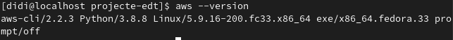  

Una vez instalado el CLI de **AWS** necesitamos conseguir la credenciales y el ID-Account de **AWS**, los cuales se encuentran en:

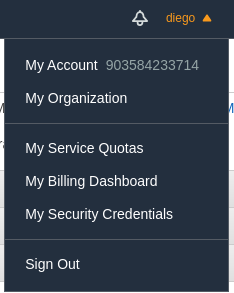  

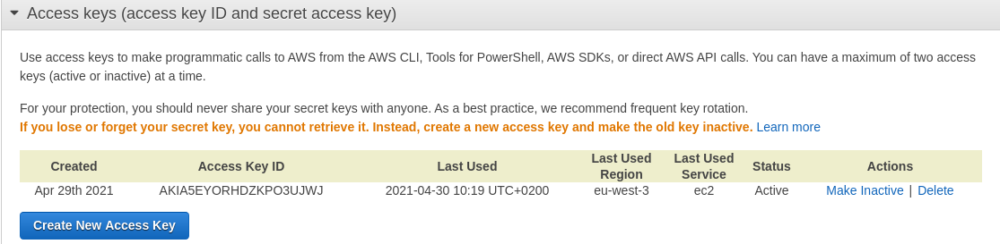  

***Al momento de crear tanto las credencias lo recomendable es guardar las estas en un lugar seguro.***

Para poder usar el CLI de **AWS** como autenticador de AWS tenemos ejecutar la orde ```aws configure```, seguidamente nos pedirá crear insertar tanto la Access Key ID y la Secret Key, luego nos pedirá insertar la region y el output (que nos obligatorios).

Una vez hecho este paso las credenciales se guardarán en el fichero ```~/.aws/credentials``` con un **profile** que es con las cuales se identificarán estas claves en el sistema operativo.

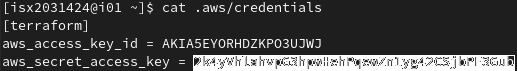

Podemos comprobar que tenemos conectividad haciendo por ejemplo ```aws ec2 describe-instances --profile terraform``` 

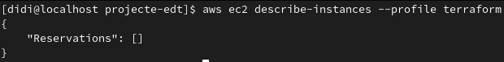

En este caso podemos ver que nos responde pero no tenemos ninguna instancia creada aún.

Ahora bien, ya hemos hecho la configuración para que, desde la terminal, podamo acceder a **AWS**, pero aún queda hacer la integración para que **Terrafom** pueda acceder y realizar cambios en **AWS**, para ello tendremos que crear un fichero .tf, que es la extensión de ficheros de configuración que utiliza **Terraform**, y en él poner lo siguiente:

```
terraform {
  required_version = ">=0.15.1"
}

provider "aws" {
  region = "eu-west-3"
  allowed_account_ids = [ "903584233714" ]
  profile = "terraform"
}
```

y hacemos ```terraform init``` en el directori donde se encuentra este fichero .tf:

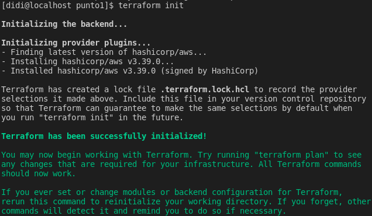

Esto lo que hará es instalar todos los plugins necesarios para poder usar los recursos que proporciona el proveedor de **AWS**.

<a name="id3"></a>
## 3. Configuración Simple

En este punto trataremos la creación de una plantilla simple de **Terraform**.

<a name="id3-1"></a>
### 3.1. Creación de un recurso

Para este punto vamos a crear un recurso básico y simple, que es un **vpc** de **AWS**, que viene a ser una red privada donde se pueden lanzar distintos recursos de **AWS**.

Para indicarle a **Terraform** que queremos crear un **vpc** tenemos que poner lo siguiente:

```
resource "aws_vpc" "vpc" {
  cidr_block = "10.0.0.0/24"
  #las instancias tienen un DNS privado
  enable_dns_hostnames = true
  enable_dns_support = true
  tags = {
    "Name" = "edt"
  }
}
```

En el cual indicamos el nombre del recurso que queremos, el nombre que le pondremos a este recurso, la ip de la red que tendrá, le asignamos un DNS privado (opcional) y le ponemos el tag de "edt".

Ahora lo que quedaría es aplicar el cambio, pero antes **Terraform** ofrece un comando que nos deja visualizar los cambio que se realizarán sin aplicarlos, así podemos comprovar que de verdad **Terraform** hará lo que queremos que haga, este comando es: ```terraform plan```:

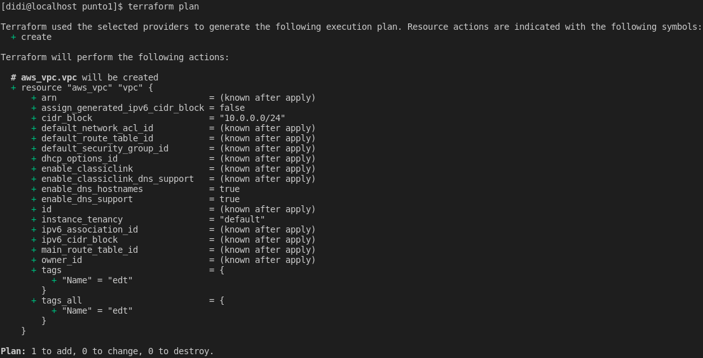

Luego que hemos comprovado que los cambios que hará **Terraform** son los que queremos hacer solo quedaría hacer un ```terraform apply``` para aplicar estos cambios.

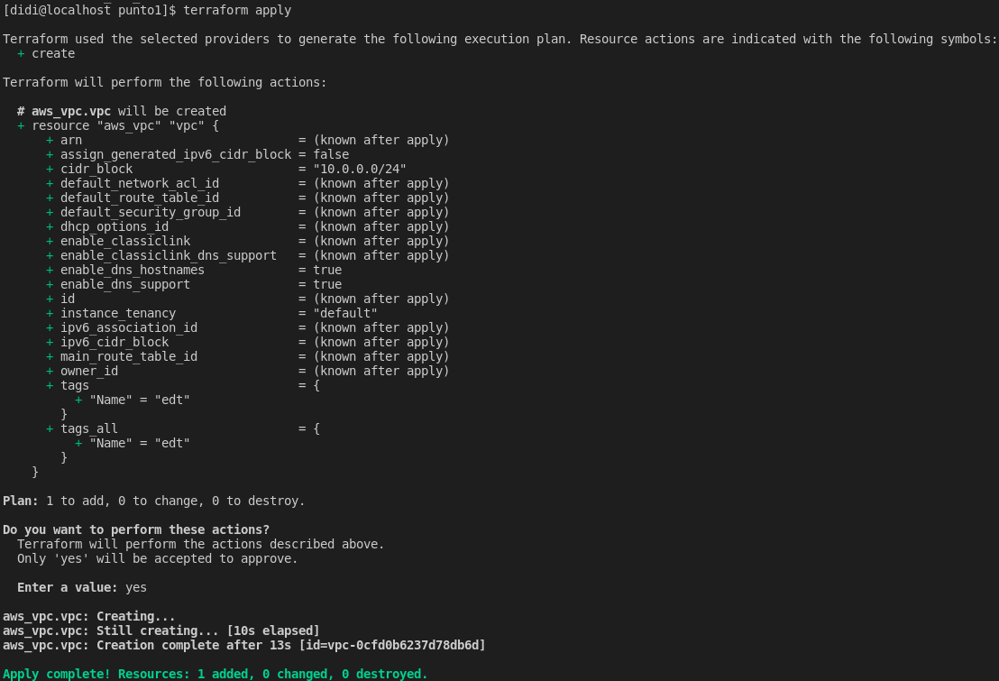

Vemos que **Terraform** con la frase del final en color verde nos confirma que ha realizado los cambios.

También podemos ver que en algún momento nos ha pedido la confimación para hacer los cambios, si queremos evitar esto tenemos que poner el argumento ```--auto-approve``` seguidamente de ```terraform apply```.


Y si nos dirigimos a la página de **AWS** vemos que nuestro **vpc** se ha creado correctamente, con los tags y la ip indicados.

<a name="id3-2"></a>
### 3.2. Fichero de estado

Al momento de hacer el ```terraform apply``` en el punto anterior, es decir cuando creamos el **vpc**, **Terraform** creo un fichero de nombre **terraform.tfstate** el cual contiene el estado de la infraestructura que tiene **AWS** y de lo que se ha creado en él.

Si accedemos al fichero **terraform.tfstate** podremos ver está declarado el recurso que hemos creado con sus respectivas características:


En caso de que hagamos algún cambio, lo que hace **Terraform** es al momento de alterar el fichero **terraform.tfstate** inmediatamente hace un **terraform.tfstate.backup** que contiene el antiguo fichero **terraform.tfstate** por seguridad.

Este fichero es muy importante ya que, aparte de lo mencinado anteriormente, **Terraform** lo usa como punto de vista del mundo exterior, es decir de la infraestructura actual que tiene **AWS** en este caso y, por lo tanto, en caso de que este fichero sea borrado **Terrafom** no sabría que hay en **AWS** y lo volvería a crear todo.

Esto también implica que si hacemos algún cambio directamente en **AWS**, cambiar el tan Name de la **vpc** por ejemplo, como el fichero **terraform.tfstate** no se ha actualizado **Terraform** seguirá pensando que la **vpc** tiene que tener el nombre que está esepecificado en el fichero .tf:


Cambiamos directamente en **AWS** el tag de la **vpc** de "edt" a "hola", pero sin modificar el fichero **terraform.tfstate**.

Hacemos un ```terraform plan``` a ver que detecta **Terraform**:

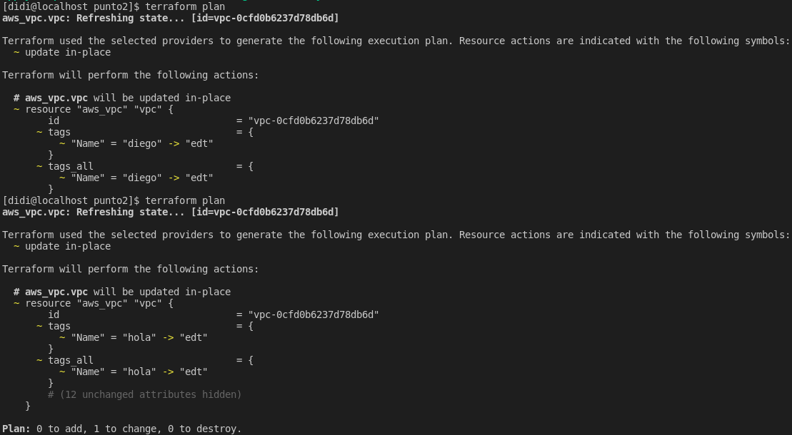

Vemos que **Terraform** detecta que en su definición está puesto que el tag debe ser "edt" y en **AWS** tiene el tag "hola" por lo tanto él lo cambiará.

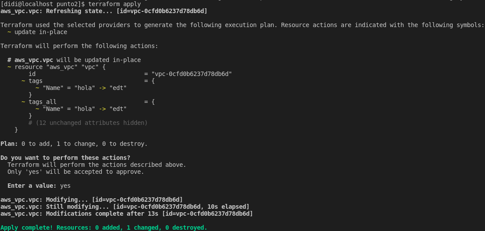

y si actualizamos la página de **AWS** vemos que se aplican los cambios:


**También es importantes fijarnos los cambios que se puede hacen ```in-place``` , es decir que se pueden aplicar en caliente y lo que fuerzan a hacer un destroy y un add, esto lo sabremos haciendo ```terraform plan```**


<a name="id3-3"></a>
### 3.3. Variables

Con el uso de variables tendremos la posibildad de crear plantillas que sean modificables ya que los valores se encuentran otro fichero .tf donde estarán alocadas las variables con sus respectivos valores.

Para declarar el recurso de variables se hace de la siguiente manera:

**variables.tf:**

```
variable "cidr" {
  type = string
  default = "10.0.0.0/24"
}
```

**vpc.tf:**

```
resource "aws_vpc" "vpc" {
  cidr_block = "${var.cidr}"
  #las instancias tienen un DNS privado
  enable_dns_hostnames = false
  enable_dns_support = false
  tags = {
    "Name" = "edt"
  }
}
```

También es de buena práctica mantener el directorio de trabajo ordenado, y aprovechando que **Terraform** nos permite tener más de un fichero .tf separaremos los diferentes recursos que usemos en ficheros diferentes.

<a name="id3-4"></a>
### 3.4. Outputs y Recurso Instancia

Para este apartado crearemos una instancia de tipo **ec2**, para ellos necesitamos declara un nuevo recurso de **AWS** llamado: ```aws_instance```:

```
resource "aws_instance" "servidor-web" {
  ami = "${var.ami-id}"
  instance_type = "${var.instance-type}"
}
```

El valor de la ami que se usará y el tipo de instancia están declarados en el fichero **variables.tf**

```
variable "ami-id" {
  type = string
  default = "ami-0f7cd40eac2214b37"
}

variable "instance-type" {
  type = string
  default = "t2.micro"
}
```

Una vez tenemos la configuración de la instancia que queremos desplegar usaremos otro recurso llamado **output** que al momento de crearse la instancia nos saldrá por la terminal (stdout) la información que hayamos indicado al recurso **output** .

Este recurso, en determinados casos es muy útil, por ejemplo al desplegar la isntancia queremos saber qué ip pública tendrá para luego poder acceder a ella y con el recurso **output** nos ahorramos tener que dirigirnos a la página web de **AWS** y buscar cuál es la dirección ip pública de la instancia creada.

Siguiendo el criterio de order crearemos otro fichero de nombre "outputs.tf" y ahí declararemos todos los output que queramos.

Para declarar el recurso **output** se hace de la siguiente forma:

```
output "public-instance-ip" {
  value = "${aws_instance.servidor-web.public_ip}"
}
```

Podemos ver que en **value** le indicamos el recurso de instancia, el nombre de la instancia que hayamos puesto y qué caracterítica de la instancia queremos que muestre.

Ahora queda hacer un ```terraform apply``` y ver el resultado del output:

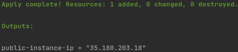

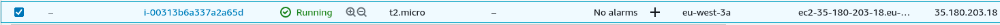

<a name="id3-5"></a>
### 3.5. Templates

El recurso **templates** es muy útil ya que, entre otras utilidades, nos permite hacer scripts con variables que se les puede pasar para luego ejecutarlo como **user_data**, **user-data** viene a ser la utilidad que tiene **AWS** para ejecutar scripts. 

Esta utilidad junto con este recurso vienen muy bien al momento de hacer el despliegue de servicios.

Para declarar el recurso **templates** tenemos que poner lo siguiente:

```
data "template_file" "install" {
  template = "${file("templates/install.tpl")}"
  vars = {
    webserver = "apache2"
  }
}
```
En verdad este recurso pertene a otro proveedor, por lo tanto tenemos que ejecutar ```terraform init``` para que pueda instalar los plugins necesarios para el funcionamiento de este recurso.

***El nombre del recurso será install y usará un fichero install.tpl que a su vez se encuentra en el directorio templates.***

**install.tpl**
```
#!/bin/bash
apt-get -y install $(webserver)
service $(webserver) start
```

El fichero "install.tpl" consiste en un script que hace la instalación de apache2 en una instancia con ami de Ubutu.

Pero para que esto se pueda aplicar a la instancia que estamos desplegando, tenemos hacer uso de la utilidad **user_data** que proporcia el recurso de instancias de **AWS**:

```
resource "aws_instance" "servidor-web" {
  ami = "${var.ami-id}"
  instance_type = "${var.instance-type}"
  user_data = "${data.template_file.install.rendered}"
}
```

Le indicamos que queremos usar el *"render"* del script ya que este sustituye las varibles por su valor en si, en este caso "apache2" por $(webserver)