# Procedimiento

## Índice
1. [Instalación](#id1)  
2. [Providers](#id2)  
   1.1. [AWS Provider](#id2-1)  
3. [Configuración Simple](#id3)  
   3.1. [Creación de un recurso](#id3-1)  
   3.2. [Fichero de estado](#id3-2)  
   3.3. [Varibales](#id3-3)  
   3.4. [Outputs y Recurso Instancias](#id3-4)  
   3.5. [Templates](#id3-5)  
   3.6. [Múltiples Recursos](#id3-6)  
   3.7. [Interpolación](#id3-7)  
   3.8. [Elastic Load Balance](#id3-8)  
   3.9. [Security Groups](#id3-9)  
   3.10. [Relational Data Base](#id3-10)  
4. [Ejercicio Final](#id4)  

<a name="id1"></a>
### 1. Instalación  

La instalación de Terraform un muy sencilla, para poder instalarlo tenemos que descargar un archivo comprimdo que contiene el binario de **Terraform** de la la página de [Terraform](https://www.terraform.io/downloads.html), ahí encontraremos las diferentes opciones para los diferentes sistemas operativos y distribuciones disponibles como MacOS,FreeBSD, Linux, OpenBSD, Solaris, Windows, también encontramos opciones a la arquitectura, ya sea 32-bits, 64-bits, Arm o Arm64.

  

Para este caso descargamos el comprimido .zip para una máquina de distribución Linux de 64-bits.

Lo descomprimimos y lo vemos a al directorio /usr/bin/ para poder ejecutarlo desde cualquier lugar:

  

y listo, ya estaría instalado y listo para usarse.

<a name="id2"></a>
### 2. Providers

Los providers son ***"plugins"*** que permiten a **Terraform** interactuar con sistemas remotos, la primera configuracón de **Terraform** tiene que ser la declaración de que providers vamos a usar, así él puede instalarlos y usar los tipos de recursos (***resource types***) y fuente de datos (***data sources***).

* **resource types:**  
  Son los elementos más importantes al momento de configurar la infraestructura, ya que estos elementos describen uno o mas objetos como redes virtuales, instancias, etc.

```
resource "aws_instance" "web" {
  ami           = "ami-a1b2c3d4"
  instance_type = "t2.micro"
}
```

* **data sources:**  
  Son fuentes de datos que nos proporciona el provider que no están incluidas en Terraform, con estas fuentes de datos podemos buscar y crear recursos referenciando a esas fuentes de datos.

```
data "aws_ami" "example" {
  most_recent = true

  owners = ["self"]
  tags = {
    Name   = "app-server"
    Tested = "true"
  }
}
```
  
<a name="id21"></a>
### 2.1. AWS Provider

Para hacer la integración de **Terraform** con **AWS** lo primero que tenemos que hacer es crear una cuenta ***IAM*** en **AWS** por tal que **Terraform** pueda crear recursos.

Tabíen tendremos que instalar el AWS CLI (command line interface) por tal de poder gestionar nuestras credenciales quet tenemos en **AWS** que nos permitirán gestionar los recursos desde **Terraform**.

* **Instalación AWS CLI**:
  La instalación es muy secilla y está descrita paso a paso y con diferenes alternativas con la [página de AWS](https://docs.aws.amazon.com/cli/latest/userguide/install-cliv2.html), en este caso instalaremos la versión de **AWS CLI** [para Linux](https://docs.aws.amazon.com/cli/latest/userguide/install-cliv2-linux.html)

  * Descargamos el archivo comprimido que contiene, entre otras cosas, un script para la instalación de **AWS CLI**:
  
  ```
    curl "https://awscli.amazonaws.com/awscli-exe-linux-x86_64.zip" -o "awscliv2.zip"
  ```

  * Los descomprimimos:
  
  ```
    unzip awscliv2.zip
  ```

  * Y ejecutamos el script de instalación:
  
  ```
    sudo ./aws/install
  ```
  
  Y listo ya tenemos el CLI de **AWS** instalado, lo podemos comprovar haciendo ```aws --version```:

  

Una vez instalado el CLI de **AWS** necesitamos conseguir la credenciales y el ID-Account de **AWS**, los cuales se encuentran en:

  

  

***Al momento de crear tanto las credencias lo recomendable es guardar las estas en un lugar seguro.***

Para poder usar el CLI de **AWS** como autenticador de AWS tenemos ejecutar la orde ```aws configure```, seguidamente nos pedirá crear insertar tanto la Access Key ID y la Secret Key, luego nos pedirá insertar la region y el output (que nos obligatorios).

Una vez hecho este paso las credenciales se guardarán en el fichero ```~/.aws/credentials``` con un **profile** que es con las cuales se identificarán estas claves en el sistema operativo.


Podemos comprobar que tenemos conectividad haciendo por ejemplo ```aws ec2 describe-instances --profile terraform``` 


En este caso podemos ver que nos responde pero no tenemos ninguna instancia creada aún.

Ahora bien, ya hemos hecho la configuración para que, desde la terminal, podamo acceder a **AWS**, pero aún queda hacer la integración para que **Terrafom** pueda acceder y realizar cambios en **AWS**, para ello tendremos que crear un fichero .tf, que es la extensión de ficheros de configuración que utiliza **Terraform**, y en él poner lo siguiente:

```
terraform {
  required_version = ">=0.15.1"
}

provider "aws" {
  region = "eu-west-3"
  allowed_account_ids = [ "903584233714" ]
  profile = "terraform"
}
```

y hacemos ```terraform init``` en el directori donde se encuentra este fichero .tf:


Esto lo que hará es instalar todos los plugins necesarios para poder usar los recursos que proporciona el proveedor de **AWS**.

<a name="id3"></a>
## 3. Configuración Simple

En este punto trataremos la creación de una plantilla simple de **Terraform**.

<a name="id3-1"></a>
### 3.1. Creación de un recurso

Para este punto vamos a crear un recurso básico y simple, que es un **vpc** de **AWS**, que viene a ser una red privada donde se pueden lanzar distintos recursos de **AWS**.

Para indicarle a **Terraform** que queremos crear un **vpc** tenemos que poner lo siguiente:

```
resource "aws_vpc" "vpc" {
  cidr_block = "10.0.0.0/24"
  #las instancias tienen un DNS privado
  enable_dns_hostnames = true
  enable_dns_support = true
  tags = {
    "Name" = "edt"
  }
}
```

En el cual indicamos el nombre del recurso que queremos, el nombre que le pondremos a este recurso, la ip de la red que tendrá, le asignamos un DNS privado (opcional) y le ponemos el tag de "edt".

Ahora lo que quedaría es aplicar el cambio, pero antes **Terraform** ofrece un comando que nos deja visualizar los cambio que se realizarán sin aplicarlos, así podemos comprovar que de verdad **Terraform** hará lo que queremos que haga, este comando es: ```terraform plan```:


Luego que hemos comprovado que los cambios que hará **Terraform** son los que queremos hacer solo quedaría hacer un ```terraform apply``` para aplicar estos cambios.


Vemos que **Terraform** con la frase del final en color verde nos confirma que ha realizado los cambios.

También podemos ver que en algún momento nos ha pedido la confimación para hacer los cambios, si queremos evitar esto tenemos que poner el argumento ```--auto-approve``` seguidamente de ```terraform apply```.

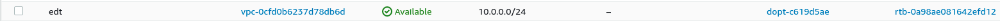

Y si nos dirigimos a la página de **AWS** vemos que nuestro **vpc** se ha creado correctamente, con los tags y la ip indicados.

<a name="id3-2"></a>
### 3.2. Fichero de estado

Al momento de hacer el ```terraform apply``` en el punto anterior, es decir cuando creamos el **vpc**, **Terraform** creo un fichero de nombre **terraform.tfstate** el cual contiene el estado de la infraestructura que tiene **AWS** y de lo que se ha creado en él.

Si accedemos al fichero **terraform.tfstate** podremos ver está declarado el recurso que hemos creado con sus respectivas características:

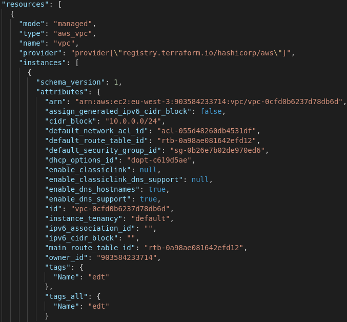

En caso de que hagamos algún cambio, lo que hace **Terraform** es al momento de alterar el fichero **terraform.tfstate** inmediatamente hace un **terraform.tfstate.backup** que contiene el antiguo fichero **terraform.tfstate** por seguridad.

Este fichero es muy importante ya que, aparte de lo mencinado anteriormente, **Terraform** lo usa como punto de vista del mundo exterior, es decir de la infraestructura actual que tiene **AWS** en este caso y, por lo tanto, en caso de que este fichero sea borrado **Terrafom** no sabría que hay en **AWS** y lo volvería a crear todo.

Esto también implica que si hacemos algún cambio directamente en **AWS**, cambiar el tan Name de la **vpc** por ejemplo, como el fichero **terraform.tfstate** no se ha actualizado **Terraform** seguirá pensando que la **vpc** tiene que tener el nombre que está esepecificado en el fichero .tf:


Cambiamos directamente en **AWS** el tag de la **vpc** de "edt" a "hola", pero sin modificar el fichero **terraform.tfstate**.

Hacemos un ```terraform plan``` a ver que detecta **Terraform**:


Vemos que **Terraform** detecta que en su definición está puesto que el tag debe ser "edt" y en **AWS** tiene el tag "hola" por lo tanto él lo cambiará.


y si actualizamos la página de **AWS** vemos que se aplican los cambios:

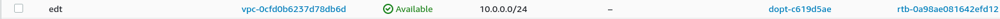

**También es importantes fijarnos los cambios que se puede hacen ```in-place``` , es decir que se pueden aplicar en caliente y lo que fuerzan a hacer un destroy y un add, esto lo sabremos haciendo ```terraform plan```**


<a name="id3-3"></a>
### 3.3. Variables

Con el uso de variables tendremos la posibildad de crear plantillas que sean modificables ya que los valores se encuentran otro fichero .tf donde estarán alocadas las variables con sus respectivos valores.

Para declarar el recurso de variables se hace de la siguiente manera:

**variables.tf:**

```
variable "cidr" {
  type = string
  default = "10.0.0.0/24"
}
```

**vpc.tf:**

```
resource "aws_vpc" "vpc" {
  cidr_block = "${var.cidr}"
  #las instancias tienen un DNS privado
  enable_dns_hostnames = false
  enable_dns_support = false
  tags = {
    "Name" = "edt"
  }
}
```

También es de buena práctica mantener el directorio de trabajo ordenado, y aprovechando que **Terraform** nos permite tener más de un fichero .tf separaremos los diferentes recursos que usemos en ficheros diferentes.

<a name="id3-4"></a>
### 3.4. Outputs y Recurso Instancia

Para este apartado crearemos una instancia de tipo **ec2**, para ellos necesitamos declara un nuevo recurso de **AWS** llamado: ```aws_instance```:

```
resource "aws_instance" "servidor-web" {
  ami = "${var.ami-id}"
  instance_type = "${var.instance-type}"
}
```

El valor de la ami que se usará y el tipo de instancia están declarados en el fichero **variables.tf**

```
variable "ami-id" {
  type = string
  default = "ami-0f7cd40eac2214b37"
}

variable "instance-type" {
  type = string
  default = "t2.micro"
}
```

Una vez tenemos la configuración de la instancia que queremos desplegar usaremos otro recurso llamado **output** que al momento de crearse la instancia nos saldrá por la terminal (stdout) la información que hayamos indicado al recurso **output** .

Este recurso, en determinados casos es muy útil, por ejemplo al desplegar la isntancia queremos saber qué ip pública tendrá para luego poder acceder a ella y con el recurso **output** nos ahorramos tener que dirigirnos a la página web de **AWS** y buscar cuál es la dirección ip pública de la instancia creada.

Siguiendo el criterio de order crearemos otro fichero de nombre "outputs.tf" y ahí declararemos todos los output que queramos.

Para declarar el recurso **output** se hace de la siguiente forma:

```
output "public-instance-ip" {
  value = "${aws_instance.servidor-web.public_ip}"
}
```

Podemos ver que en **value** le indicamos el recurso de instancia, el nombre de la instancia que hayamos puesto y qué caracterítica de la instancia queremos que muestre.

Ahora queda hacer un ```terraform apply``` y ver el resultado del output:


<a name="id3-5"></a>
### 3.5. Templates

El recurso **templates** es muy útil ya que, entre otras utilidades, nos permite hacer scripts con variables que se les puede pasar para luego ejecutarlo como **user_data**, **user-data** viene a ser la utilidad que tiene **AWS** para ejecutar scripts. 

Esta utilidad junto con este recurso vienen muy bien al momento de hacer el despliegue de servicios.

Para declarar el recurso **templates** tenemos que poner lo siguiente:

```
data "template_file" "install" {
  template = "${file("templates/install.tpl")}"
  vars = {
    webserver = "apache2"
  }
}
```
En verdad este recurso pertene a otro proveedor, por lo tanto tenemos que ejecutar ```terraform init``` para que pueda instalar los plugins necesarios para el funcionamiento de este recurso.

***El nombre del recurso será install y usará un fichero install.tpl que a su vez se encuentra en el directorio templates.***

**install.tpl**
```
#!/bin/bash
apt-get -y install $(webserver)
service $(webserver) start
```

El fichero "install.tpl" consiste en un script que hace la instalación de apache2 en una instancia con ami de Ubutu.

Pero para que esto se pueda aplicar a la instancia que estamos desplegando, tenemos hacer uso de la utilidad **user_data** que proporcia el recurso de instancias de **AWS**:

```
resource "aws_instance" "servidor-web" {
  ami = "${var.ami-id}"
  instance_type = "${var.instance-type}"
  user_data = "${data.template_file.install.rendered}"
}
```

Le indicamos que queremos usar el *"render"* del script ya que este sustituye las varibles por su valor en si, en este caso "apache2" por $(webserver), esto se puede ver en el fichero **terraform.tfstate**:

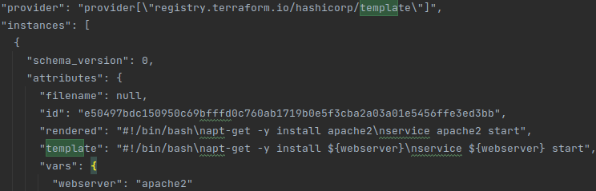  

Una vez hecha la configuración, hacemos un ```terraform plan``` y podremos ver que este cambio requiere hacer un destroy y un add de la instancia.

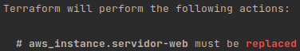

Ahora queda hacer un ```terraform apply --auto-approval``` para poder aplicar los cambios.

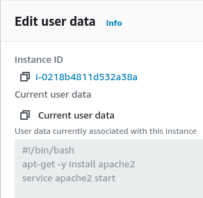

Podemos ver que en **AWS** se ha aplicado el script en user_data.

<a name="id3-6"></a>
### 3.6. Múltiples recursos

**Terraform** tiene dos opciones muy útil para lanzar varios recursos a la vez si tener que poner la misma estructura repetitivamente, esta opciones son:

* **count:**

```
resource "aws_instance" "webservers" {
  ami = "ami-0f7cd40eac2214b37"
  instance_type = "t2.micro"
  count = 2
  tags {
    Name = "webservers"
  }
}
```

Como en el valor de **count** le hemos puesto 2, **Terraform** nos creará 2 instancias ec2, webservers[0] y webserver[1].

Ahora si hacemos un ```terraform apply``` podremos comprobar que las dos instancias se han creado correctamente:

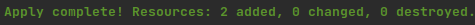

Y si vamos a la página web de **AWS** podremos ver en el ***dashboard*** que las dos instancias están creadas.


* **autoscaling:**
  Este método es un poco mas complidao pero a cambio nos da mucha más flexibilidad de opciones al momento de crear las instancias:

```
resource "aws_launch_configuration" "web-server" {
name_prefix = "web-server-"
image_id = "ami-0f7cd40eac2214b37"
instance_type = "t2.micro"
key_name = "terraform-key"
security_groups = ["${aws_security_group.web-sg.id}"]
user_data = "${file("templates/install.tpl")}"
lifecycle {
  create_before_destroy = true
}
}
resource "aws_autoscaling_group" "as-web" {
  name = "${aws_launch_configuration.web-server.name}"
  launch_configuration = "${aws_launch_configuration.web-server.name}"
  max_size = 1
  min_size = 1
  load_balancers = ["${aws_elb.elb-web.id}"]
  vpc_zone_identifier = ["${aws_subnet.publica.id}"]
  wait_for_elb_capacity = 1
  tag {
    key = "Name"
    propagate_at_launch = true
    value = "web-server"
  }
  lifecycle {
    create_before_destroy = true
  }
}
```

Como podemos ver primero creamos el recurso de ***aws_launch_configuration*** que es donde vamos a especificar todas las caracteristicas que van a tener las instancias que vamos a crear posteriormente con el **autoscaling** (esto es opcional pero es de buena práctica ya que así lo tenemos mas ordenado y su vez inteligible).

Una vez creado y configurado el recurso **aws_launch_configuration** pasamos a crear y configurar el recurso que, de hecho, desplegará las instancias, este recurso es **aws_autoscaling_group**:

* **name:**
  En este elemento pondremos el nombre que tendrá el recurso **austoscaling** en **AWS**
* **launch_configuration:**
  Aquí le especificamos que cual es el **launch configuration** con las características de las instancias que lanzaremos.
* **max_size:**
  Aqui le decimos el máximo de instancias que queremos lanzar
* **min_size:**
  Aquí le decimos el mínimo de instancias que queremos lanzar
***Estas dos últimas opciones son obligatorias ya que así el **autoscaling** sabe cuantas instancias tiene que lanzar***
* **tag:**
  * **key:**
  Aquí le indicamos que tipo de tag le pondremos, en este caso en nombre.
  * **propagate_at_lunch:**
  Esta opción es para indicarle que este nombre se aplique a todas las intancias desplegadas,
  * **value:**
  Y en esta ocpción ponemos del valor del nombre que queremos que todas instancias tengas al momento de ser lanzadas.
* **lifecycle:**
  * **create_before_destroy:**
  Esta opción es para indicarle que, en caso de que haya otro recurso **autoscaling**, primero cree el nuevo y despues destruya el anterior.

Hacemos ```terraform apply``` y comprobamos que los recursos e instancia se han creado correctamente:

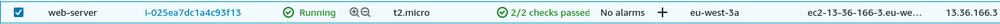


<a name="id3-7"></a>
### 3.7. Interpolación:

Este tipo de interpolación es muy útil ya que dependiendo de la región donde nos enctremos cambiaran los IDs de las amis de **AWS**, por lo tanto creamos esta utilidad para que sea mucho más fácil usar la ami correcta dependiendo de la región donde nos encontramos.

Para usar este método necesitamos crear una variable de tipo map se rige por **key = value**, es decir que dependiendo de la region se le asiganará una ami diferenete:

```
variable "aws_amis" {
  type = map
  default = {
    "us-east-1" = "ami-09e67e426f25ce0d7" #Virginia
    "us-east-2" = "ami-00399ec92321828f5" #Ohio
    "us-west-1" = "ami-0d382e80be7ffdae5" #California
    "us-west-2" = "ami-03d5c68bab01f3496" #Oregon
    "ap-northeast-3" = "ami-0001d1dd884af8872" #Osaka
    "ap-northeast-2" = "ami-04876f29fd3a5e8ba" #Seoul
    "ap-southeast-1" = "ami-0d058fe428540cd89" #Singapore
    "ap-southeast-2" = "ami-0567f647e75c7bc05" #Sydney
    "ap-northeast-1" = "ami-0df99b3a8349462c6" #Tokyo
    "ca-central-1" = "ami-0801628222e2e96d6" #Central
    "eu-central-1" = "ami-05f7491af5eef733a" #Frakfurt
    "eu-west-1" = "ami-0a8e758f5e873d1c1" #Ireland
    "eu-west-2" = "ami-0194c3e07668a7e36" #London
    "eu-west-3" = "ami-0f7cd40eac2214b37" #Paris
    "eu-north-1" = "ami-0ff338189efb7ed37" #Stockholm
    "sa-east-1" = "ami-054a31f1b3bf90920" #São Paulo
  }
}
```
***Las amis de una maquina ubuntu***

Por lo tanto, una vez tenemos esta variable creada, poder hacer uso de esta:

Por ejemplo al momento de especifcar que ami usar en el **launch_configuration** del punto anterior:

```
resource "aws_launch_configuration" "web-server" {
  name_prefix = "web-server-"
  image_id = "${lookup(var.aws_amis, var.region)}"
  instance_type = "${var.instance_type}"
  key_name = "terraform-key"
  security_groups = ["${aws_security_group.web-sg.id}"]
  user_data = "${file("templates/install.tpl")}"
  lifecycle {
    create_before_destroy = true
}
```

Hacemos uso de la función **lookup** que lo que hace es recibir la lista de amis que hemos creado anteriormente y la región donde estamos usando **AWS**.

***En este caso la región está guardad en una variable llamada "region":***

```
variable "region" {
  type = string
  default = "eu-west-3"
}
```

<a name="id3-8"></a>
### 3.8. Elastic Load Balancer:
Primero que nada, ¿qué es un Elastic Load Balancer(eln)?

Un Load Balancer acepta tráfico de entrada de peticiones provinientes de clientes o routers hacia unos "targets" registrados en **AWS**, una instancia EC2 por ejemplo, y una vez que el "target" está funcionando correctamente y puede recibir peticiones, redirige esta petición a dicho "target".

Tambíen nos proporciona un **domain name** por tal de poder acceder poniendo este en vez de la ip pública del servicio, en caso de que sea un servidor web por ejemplo.

La declaración de este recurso es la siguiente:

```resource "aws_elb" "elb-web" {
  name = "edt-web"
  cross_zone_load_balancing = true
  subnets = ["${aws_subnet.publica.id}"]

  listener {
    instance_port = 80
    instance_protocol = "http"
    lb_port = 80
    lb_protocol = "http"
  }
  security_groups = ["${aws_security_group.elb-sg.id}"]
}
```
* **name:**
  En esta opción le especificamos el nombre que tendrá el elb en **AWS**.
* **cross_zone_load_balancing:**
  Esta opción es para especificarle que actue en más de una *"availability zone"*.
* **subnets:**
  Para indicarle en que sub redes actue el balanceador, esta opción es obligatoria si se está unsando una VPC para poner todos los recursos.
* **listener:**
  Tiene que poder *"escuchar*" por al menos un puerto, en este caso el pueto 80.

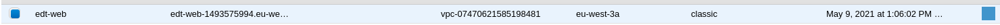

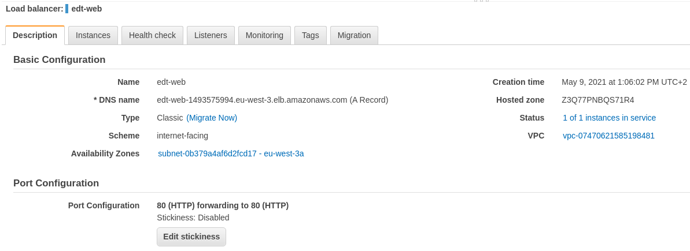

<a name="id3-9"></a>
### 3.9. Security Groups
Este recurso sirver para añadir un security group en **AWS**, un security group es un grupo de reglas de entrada y salida en la cuales se especifica que puerto o rango de puertos quedan abierto para determinadas ips.

La declaración de este recurso es la siguiente:

```
resource "aws_security_group" "elb-sg" {
  name = "elb-sg"
  vpc_id = "${aws_vpc.vpc.id}"
  ingress {
    from_port = 80
    protocol = "tcp"
    to_port = 80
    cidr_blocks = ["0.0.0.0/0"]
  }
  egress {
    from_port = 0
    protocol = "-1"
    to_port = 0
    cidr_blocks = ["0.0.0.0/0"]
  }
}
```

En este ejemplo le estamos especificando un security group al balanceador del apartado anterior.

Estamos permitiendo el tráfico de entrada al puerto 80 (from_port y to_port) del protocolo "tcp" (protocol) desde cualquier origen (cidr_blocks).

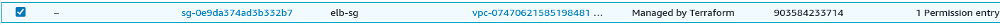

**Reglas de entrada:**

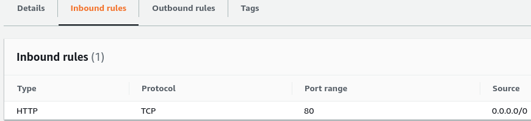

**Reglas de salida:**

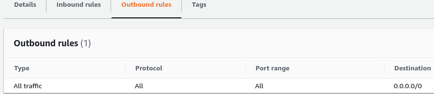

<a name="id3-10"></a>
### 3.10. Relational Data Base:

Este recurso crea una instancia de base datos dentro de **AWS** que es llamda **RDB**.

La **RDB** es un tipo de instancia que porporciona un entorno aislado en la nube de **AWS**, este tipo de instancia también necesita tener al menos 2 subnet por si en caso falla una, empieza a actuar otra que se encuentre en otra subnet.

La declaración de este recurso es de la siguiente forma:

```
resource "aws_db_subnet_group" "subn-groups" {
  subnet_ids = ["${aws_subnet.privada1.id}","${aws_subnet.privada2.id}"]
}

resource "aws_db_instance" "mydb" {
  instance_class = "db.t2.micro"
  identifier = "mydb"
  username = "${var.rds_username}"
  password = "${var.rds_passwd}"
  engine = "postgres"
  allocated_storage = 10
  storage_type = "gp2"
  multi_az = false
  db_subnet_group_name = "${aws_db_subnet_group.subn-groups.name}"
  vpc_security_group_ids = ["${aws_security_group.rds-sg.id}"]
  publicly_accessible = true
  skip_final_snapshot = true
}
```

Como se ha comentado antes, tenemos que crear un grupo de subnets para los RDBs. 

El nombre del recurso que proporciona el RDB es ```aws_db_instance``` en **Terraform**.

* **instance class:**
  Es donde especificamos el tipo de instancia que tendrá la RDB.
* **identifier:**
  El nombre que tendrá la RDB.
* **username:**
  El user con el que se creará la RDB.
* **password:**
  El password que tendrá el user.
* **engine:**
  Que engine de base de datos relacional va a tener la RDB, en este caso **postgresql**.
* **allocated_storage:**
  El espacio de disco que tendrá la RDB.
* **storage_type**
  El tipo de dispositivo de almacenaje que tendrá el disco.
* **multi_az:**
  Es para indicarle si la RDB estará esparcida por diferentes availability zones.
* **db_subnet_group:**
  El grupo de subntes en las que estarán cada una de las RDBs.
* **vpc_security_group_ids:**
  El security group que tendrá la RDB, para poder controlar las reglas de entrada y salida que tendrá la RDB.
* **publicy_accessible:**
  Esta opción es para indicar que esta RDB dipondrá de acceso público
* **skip_final_snapshot:**
  Esta opción es para que al momento de elimarse esta RDB se cree una snapshot.

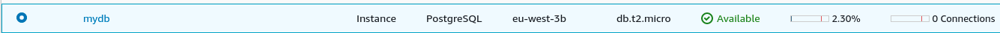

<a name="id4"></a>
## 4. Ejercicio final:

Para este ejercicio final tendremos: 

* Una instancia tipo EC2 en la cual habŕa estará instalado un servidor web con el servicio de apache y php, tambíen contará con security group que hará que hará referencia al security group de de un balanceador

* Habrá una instancia de RDB que tambíen contará con su security group permitiendo el tráfico del puerto 5432. 

* Y, por último, todos estos recursos y servicios estarán dentro de una **VPC**