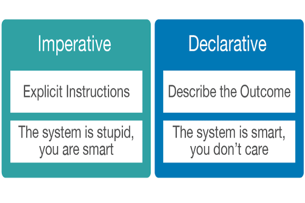

# Terraform

## Índice

1. [Infraestructura como código (IaC)](#id1)
2. [¿Qué es Terraform?](#id2)
3. [¿Que problemas resuelve?](#id3)
4. [¿En qué se diferencia de los diferentes sofwares?](#id4)

## 1. Infraestrutura como código (IaC)

 

Imaginémos que tenemos un servicio web que dispone de un servidor para la base de datos y otro servidor para el back-end y queremos desplegar un entorno de pruebas porque queremos algunos tests en este sistema y no queremos afectar al funcionamiento de este servicio web por lo tanto tendremos que deplegar una replica exacta de la infraestructura con los dos servidores que tiene nuestro servicio web, tradicionalmente tendríamos que volver a crear manualemente nuestra infraestructura (acceder al proveedor de servicios que nos de esta infraestructura, crear los servidores, configurar los servidores y desplegar las aplicaciones en ellos) y si a esto sumanos los posibles errores humanos y la falta de control sobre los cambios realizados en la arquitectura, estamos aumentando potencialmente las probilidades de que algo pueda salir mal. 

Por lo tanto con la **Infraestructura Como Código** lo que queremos es describir en código la infraestructura de nuestro proyecto, programar estructuras de hardware usando código.

Por lo tanto puede adaptarse, utilizarse es un sistema de control de código (git), puede versionarse, etc.

Existes varias herramientas para realizar este método, y una de las conocidas es **Terraform**.

## 2. ¿Qué es Terraform?

  

Terraform define la estructura mediante ficheros de configuración, con estos ficheros podemos definir partes del sistema o incluso el sistema completo, luego **Terraform** se encargará de generar un plan de ejecución que termine con la infraestructura con el estado definido en estos ficheros. 

### 2.1. Lenguaje Declarativo

 

Una configuración declarativa quiere decir que nosotros le indicamos el objetivo al que queremos llegar, un ejemplo sería en caso de que queramos llegar de un punto A a un punto B conduciendo nosotros un coche tenemos que seguir indicacación a indicación hasta llegar al destino, en cambio se pedimos un taxi solo le tenemos que decir a dónde queremos llegar, es decir solo hace falta indicarle la finalidad.

## 3. ¿Qué problemas resuelve?

## 4. ¿En qué se diferencia del difernte sofware disponible?