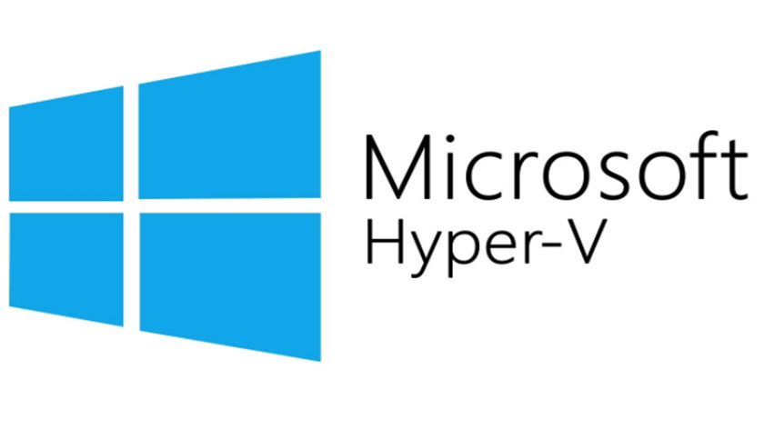
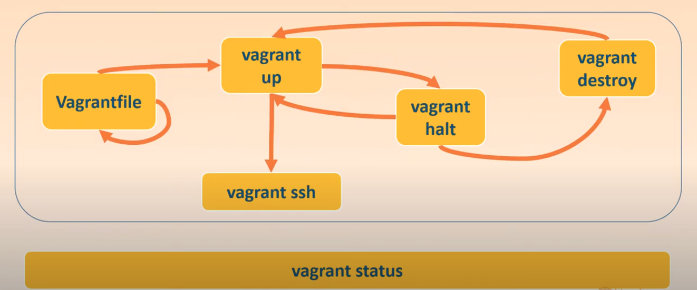
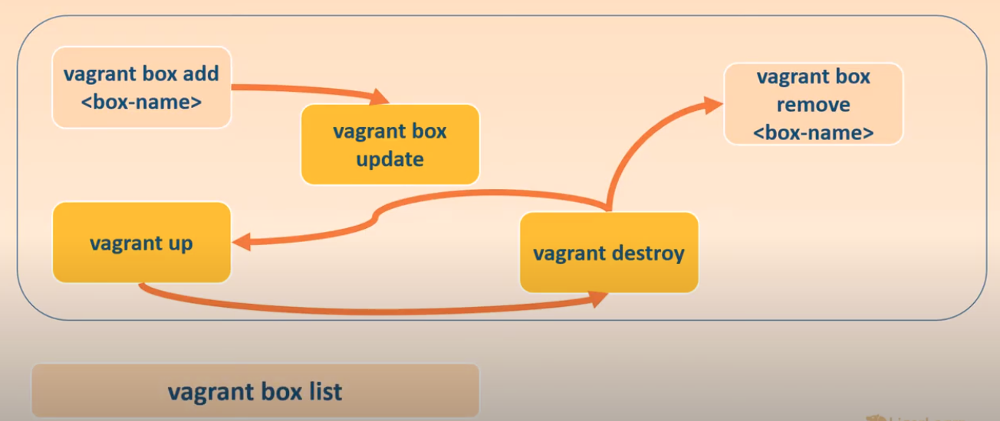
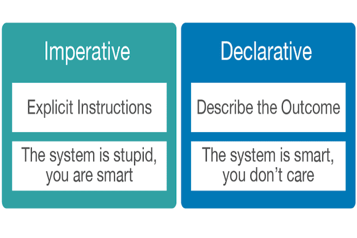
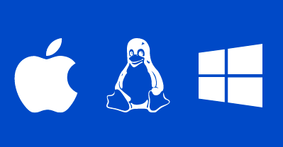
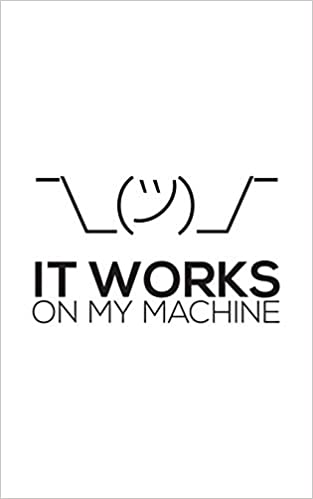
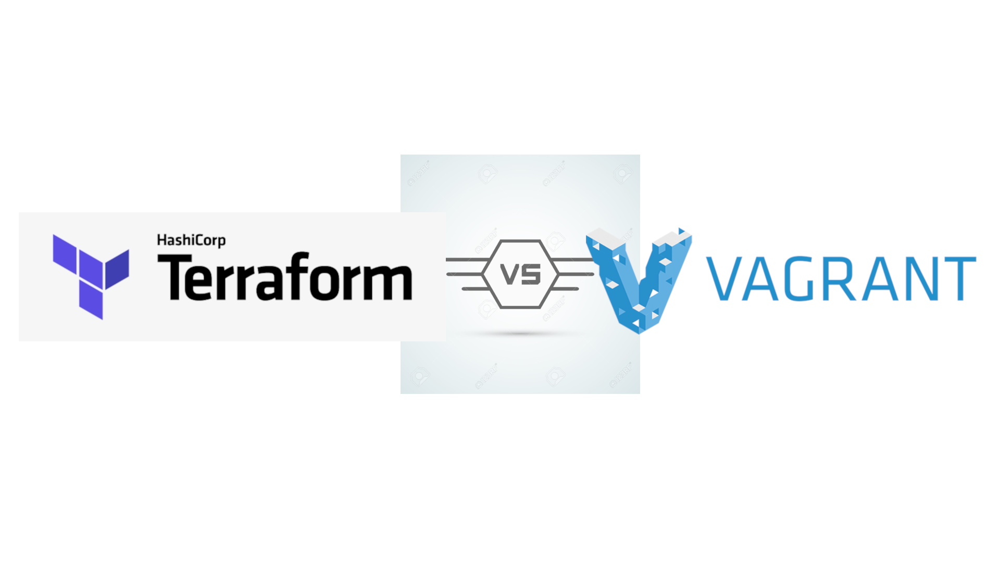

# Vagrant

## Índice

1. [¿Qué es Vagrant?](#id1)  
    
    1.1. [Proveedores](#id11)

    1.2. [Vagrant's Workflow](#id12)

2. [¿Por qué Vagrant?](#id2)  
    
    2.1. [Para desarroladores](#id21)  

    2.2. [Para administradores](#id22)  
    
    2.3. [Para diseñadores](#id23)  
    
    2.4. [Para todo el mundo](#id24)  

3. [Vagrant vs. otros softwares](#id3)
    
    3.1. [Vagrant vs. Docker](#id31)
    
    3.2. [Vagrant vs. Terraform](#id32)
    
<a name="id1"></a>
## 1. ¿Qué es Vagrant?

<br>

**Vagrant** es una herramienta de línea de comendos que permite generar entornos de desarrollo reproducibles y compatibles de forma muy sencilla, para conseguir estoy **vagrant** configura máquinas virtuales a partir de un ficher de configuración **Vagranfile** basado en el lenguage ***Ruby***

Las funciones de **vagrant** sirve para crear entornos de desarrollos de forma sencilla, también sirve para crear entornos de pruebas.

Lo que hacemos con **vagrant** no es crear una máquina virtual desde cero, sino que le pasamos un fichero de configuración indicandole que cree máquina virtual junto con las configuración que nosotros querramos, por ejemplo una máquina virtual con 4 GB de memória ram, 2 cpus, que esté conectada a 2 redes virtuales, y que al crear la máquina virtual ejecute un scritp que contiene la instalación de diferentes servicios.

Una cosa que hay que aclarar es que **vagrant** no es un proveedor de máquinas virtuales, de hecho **vagrant** necesita proveedores de máquinas virtuales.

<a name="id11"></a>
### 1.1. Proveedores

**Vagrant** actualmente tiene compatibilidad con distintos proveedores, los cuales son: [Virtualbox](https://www.virtualbox.org/), [Hyper-V](https://azure.microsoft.com/en-us/?ocid=cloudplat_hp), [docker](https://www.docker.com/) i [VMware](https://www.vmware.com/)

<a href="https://www.virtualbox.org/"><br></a>
<a href="https://azure.microsoft.com/en-us/?ocid=cloudplat_hp"><br></a>
<a href="https://www.docker.com/"><br></a>
<a href="https://www.vmware.com/"><br></a>

<a name="id12"></a>
### 1.2. Vagrant's Workflow

El funcionamiento de vagrants (workflow) se divide en 2, los cuales son el ámbito y las boxes ("imagenes")
    <ul>
        <li>**environment workflow:**
            <ul>
                <li>Vagrantfile:<br>
                Es el fichero donde indicamos que imagen para la máquina virtual y que configuración usaremos, se puede crear haciendo un ```vagrant init```o creando un el archivo desde cero</li>
                <li>vagrant up <br>
                Con ```vagrant up```lo que hacemos el *"levantar"* la máquina virtual una vez tenemos el archivo **Vagrantfile** con dicha configuración especificada.</li>
                <li>vagrant halt<br>
                Con ```vagrant halt``` lo que hacemos es parar la máquina que está activada.</li>
                <li>vagrant ssh <br>
                Con ```vagrant ssh``` lo que hacemos es conectarnos por medio de ssh a la máquina virtual para así poder administrarla desde dentro.</li>
                <li>vagrant destroy<br>
                Esta opción lo que hace, cuando ya no se necesite ese ámbito, lo borra.</li>
                <li>vagrant status<br>
                Está opción los que nos permite es monitorizar la máquina o ámbito con lo que estemos trabajando</li>
            </ul>
        
        </li>
        <li>**box workflow:** <br>
            <ul>
                <li>vagrant box add:<br>
                Está subopción sirve para añadir un box a vagrant, un box consiste entre otras cosas principalmente en una imagen y un archivo de cofiguración.
                </li>
                <li>vagrant box update:<br>
                Esta subopción sirver para actualizar un box que ya tengamos.
                </li>
                <li>vagrant box remove:<br>
                Esta subopción sirve para borrar alguna box que ya tengamos.
                </li>
                <li>Vagrant box list:<br>
                Esta subopción sirve para listar los boxes que tenemos descargados.
                </li>
            </ul>
        
        </li>
    </ul>

<a name="id2"></a>
## 2. ¿Por qué Vagrant?

Las principales razones del por qué usar **vagrant** son:
    <ul>
        <li>**Es declarativo:**<br>
        Una configuración declarativa quiere decir que nosotros le indicamos el objetivo al que queremos llegar, por ejemplo como en el apartado anterior le indicamos a vagrant que queremos lance una máquina virtual con un determinado hardware y configuración. En comparación con una declaración imperativa que viene siendo indicarle paso por paso lo que queremos hacer.
        
        </li>
        <li>**Es portable:**<br>
        Con que es portable se refiere a que podemos compartir dicho fichero de configuración con otras personas, estás personas pueden trabajar en diferentes sistemas operativos o en diferentes versiones del sistema operativo, para **vagrant** esto no es problema ya que vagrant es *cross-platform*, por lo tanto nos quitamos el problema de *"en mi máquina funciona"*.<br>
        
        </li>
    </ul>

<a name="id21"></a>
### 2.1. Para desarrolladores

<br>

Si eres un desarrollador o una dessarroladora **vagrant** puede aislar las dependencias y sus respecticas configuraciones en un único ambiente de trabajo desechable por lo tanto no se sacrificará ninguna de las herramientas con las que estas acostumbrado/a a usar, ya sean editores, navegadores, debuggers, etc. 

En caso de ser un grupo de desarroladores, una vez alguno de ellos haya creado un **Vagrantfile**, solo hace falta hacer ```vagrant up``` y todo estará instalado, configurado y listo para trabajar, en caso de que los otros miembros trabajem en otros sistemas operativos no resulta ningún problema ya que al final todos estarán usando el mismo ámbito de **vagrant** y nos quitamos el problema de *"it works on my machine"*.



<a name="id22"></a>
### 2.2. Para administradores

<br>

Vagrant te da un ámbito desechable y un workflow consistente para crear escenarios de pruebas en los cuales puedes probar scripts para la gestión de infraestructuras.

Por lo tanto puedes hacer pruebas fácil y rápidamente como *shell scripts, chef cookbooksm, puppet modules* y más usando un proveedor de máquinas virtuales locales como VirtualBox o VMware, este proceso también se puede hacer en servidores remotos de la nube como AWS, usando la misma configuración y con el mismo workflow.

<a name="id23"></a>
### 2.3. Para diseñadores

<br>

Una vez un desarroladaor haya configurado y preparado todo para la aplicación que necesite el diseñador, este no se tendrá que preocupar nunca más de configurar nada y se podrá centrar solo en desarrolar.

<a name="id24"></a>
### 2.4. Para todo el mundo

Al final **Vagrant** está diseñado para crear ámbientes de virtualización de la manera más rápida y fácil, por lo tanto es útil para todo el mundo.

<a name="id3"></a>
## 3. Vagrant vs. otros softwares

<a name="id31"></a>
### 3.1. Vagrant vs. Docker

 

**Docker** depende en el sistena operativo del host, en cambio, **vagrant** incluye el sistema operativo como parte de su paquete, por lo tanto **vagrant** puede contener cualquier sistema operativo y por otra parte los contenedores de **Docker** se ejecutan en sistemas operativos de Linux.

<a name="id32"></a>
### 3.2. Vagrant vs. Terraform



Con **Terraform** describes tu estructura completa como código y tienes la posibilidad de construir los *"resources"* a través de diferentes proveedores, por ejemplo, un servidor de base datos puede estar alojado en **Heroku** y los demás servidores pueden estar en **AWS**, **Terraform** lo que hará es lanzar todos estos servers en los diferentes proveedores en paralelo.

**Vagrant** en cambio es una herramienta que prporciona el *"framework"* y la confiuguración por tal de poder crear y gestionar ámbitos de desarrolo portable, estos ámbitos pueden estar en un host local o en la nube, y también son portables tanto para Windows, Mas OS y Linux.

http://czerasz.com/2015/01/06/vagrant-workflows/  