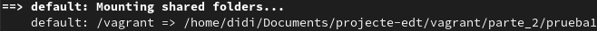
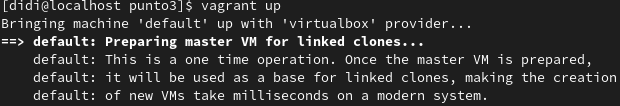
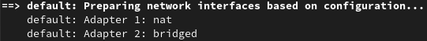

# Procedimiento

## Índice  
1. [Idea Principal](#id1)  
2. [Instalación](#id2)  
   2.1. [Vagrant](#id2-1)  
   2.2. [VirtualBox](#id2-2)  
3. [Boxes](#id3)  
   3.1. [Añadir un box](#id3-1)  
   3.2. [Lanzar un box](#id3-2)  
   3.3. [Directorio Sincronizado](#id3-3)  
   3.4. [Reempaquetar un box](#id3-4)  
   3.5. [Eliminiación e instalación de una imagen local](#id3-5)  
   2.6. [Actualización de una imagen](#id3-6)  
4. [Configuración Vagrantfile](#id4)  
   4.1. [Configuración Simple](#id4-1)  
   4.2. [Interfaz Gráfica](#id4-2)  
   4.3. [Aprovisionamiento Ligero](#id4-3)  
   4.4. [Redirección de puertos](#id4-4)  
   4.5. [Configuración red privada](#id4-5)  
   4.6. [Configuración red pública](#id4-6)  
   4.7. [Multimáquinas](#id4-7)  
5. [Ejercicio Final](#id5)  
6. [Conclusiones](#id6)  
7. [Bibliografía](#id7)  

<a name="id1"></a>
## 1. Idea Principal

La idea de principal de este documento es hacer la instalación de **Vagrant**, seguidamente hacer una serie de ejemplos prácticos para finalmente hacer un ejercicio final donde se aplican los ejemplos explicados anteriormente.

<a name="id2"></a>
## 2. Instalación

Como se ha comentado anteriormente, para usar **Vagrant** se necesita tener, al menos, un sistema de virtualización, en estos ejercicios se utilizará el sistema de vitualización inicial con el cual se desarrolló **Vagrant** que es [VirtualBox](https://www.virtualbox.org/) y que además es donde se ofrece más funcionalidad.

<a name="id2-1"></a>
### 2.1. Vagrant

La instalación de vagrant es muy secilla, en el caso de sistemas operativos como **Ubuntu**, **Debian**, **CentOS**, **Fedora**, **Amazon Linux** o **Homebrew** lo único que tenemos que hacer es:
* Añadir el repositorio
* Instalar Vagrant

```
$ sudo dnf install -y dnf-plugins-core
$ sudo dnf config-manager --add-repo https://rpm.releases.hashicorp.com/fedora/hashicorp.repo
$ sudo dnf -y install vagrant
```

<a name="id2-2"></a>
### 2.2. VirtualBox

* Para la instalación de VirtualBox, tenemos que ir a la página web de [VirtualBox](https://www.virtualbox.org/wiki/Downloads), aquí encontraremos las diferentes opciones de descarga dependiendo del sistema operativo y la distribución.

* En este caso lo instalaremos para un Fedora 32.

```
$ wget https://download.virtualbox.org/virtualbox/6.1.22/VirtualBox-6.1-6.1.22_144080_fedora32-1.x86_64.rpm

$ sudo rpm -i VirtualBox-6.1-6.1.22_144080_fedora32-1.x86_64.rpm
```

* Nos añadimos al grupo de virtualbox por tal de poder ejecutarlo correctamente:

```
$ sudo usermod -a -G vboxusers ${USER}
```
  
Una vez hecha la instalación y los demás pasos tendremos que ejecutar el setup que prorporciona VirtualBox:

```
$ sudo /usr/lib/virtualbox/vboxdrv.sh setup
```

<a name="id3"></a>
## 3. Boxes

El funcionamiento de **Vagrant** consiste en dividir la distribución de la aplicación en dos, el sistema operativo en un determinado formato, que viene a ser, entre otras cosas, la imagen de este, y por otra lado distribuimos la configuración y modificaciones de este escenario en un fichero de texto plano, que viene a ser **Vagrantfile**.

Vagrant tiene su propia [comunidad](https://app.vagrantup.com/boxes/search) en la cual todo el mundo puede subir sus boxes y ahí es donde se pueden obtener los boxes o también podemos crear nuestro propio box con ayuda de otro software, por ejemplo **packer**.

<a name="id3-1"></a>
### 3.1. Añadir un box

Para añadir un box, **Vagrant** nos proporciona el subcomando ***"box"*** que a su vez tiene más subcomandos y entre ellos encotramos ***"add"*** que es los que nos permite descargar el box que queramos:

```
$ vagrant box add [nombre del box] [opciones]
```

Como hemos dicho antes los boxes que **Vagrant** descarga, a no ser que se especifique que los queremos de una ruta local, se obtienen desde su página web de su [comunidad](https://app.vagrantup.com/boxes/search), y el nombre de estos boxes se rigen por: **username/boxname**

Ejemplo:

</a>  


***Hay que tener en cuenta que los boxes que se suben a la comunidad de Vagrant no están verificados, por lo tanto es necesario que tengamos cuidado al momento de qué box descargar***

<a name="id3-2"></a>  
### 3.2. Lanzar un box

Para el arranque de un box que hayamos descargado anteriormente tenemos que usar el subcomando ***"init"*** dentro del subcomando de ***"box"***, esto lo que hará es crear un fichero **Vagrantfile** en el cual se encuentra la configuración base para poder, posteriormentem, arrancar nuestro box con ```vagrant up```, por lo tanto, tenemos que tener en cuenta que el uso de este fichero de configuración que nos permite arrancar el box tiene que estar alojado en un directorio y en este directorio no pueden ir otros ficheros de configuración **Vagrantfile**.

En conclusión, por cada box que queramos arrancar necesitaremos un directorio diferente, esto nos permite poder tener una mejor organización de los boxes que tengamos activos.

  

Como podemos ver en la imagen, hemos hecho un ```vagrant init``` de un box llamado "ubuntu/trusty64" y automáticamente nos ha creado un fichero **Vagrantfile** en el cual especifica que al momento de hacer ```vagrant up``` se usará como *box* el box que hemos especificado.

  

Al hacer el ```vagrant up``` podemos ver que lo que **Vagrant** hace es importar el box que hemos espcificado, es decir hace una copia y sobre esta copia hace una serie de adaptaciones para que podamos utlilizar y acceder a la máquina, las adaptaciones que hace son:

* Conectarla en una red interna que proporciona VirtualBox y que tiene acceso a internet mediante **NAT**
* Abrir el puerto 2222 (en caso de que esté en uso, usa otro puerto) de la máquina anfitriona por tal de poder hacer un redirección al puerto 22 de la máquina virtual y que nosotros nos podamos conectarnos por ssh.
* Hace una serie de comprobaciones
* Monta un directorio compartido
    
Todos estos pasos se hacen automáticamente.

  

Y, como podemos ver, al hacer un simple ```vagrant ssh``` nos conectamos a la máquina lanzada y esta, por medio de NAT, puede accede al exterior y la máquina anfitriona puede contactarse con ella mediante comandos de vagrant sin ningún problema, esto lo que resuelve es tener que hacer el tedioso proceso de levantar una máquina, instalar el sistema operativo, configurarlo, etc.

Una vez tengamos la máquina encendida podemos hacer un ```vagrant status``` para poder ver el estado de esta, este comando también nos proporciona información sobre qué comandos podemos utilizar para parar, suspender o reinicar la máquina.

  

En caso de que ya no necesitemos este escenario, lo que podemos hacer es ```vagrant destroy```, que lo que hace es destruir la configuración que hayamos hecho en la máquna una vez iniciada.  

  

<a name="id3-3"></a>  
### 3.3. Directorio Compartido

La gran mayoría de los boxes de **Vagrant** suelen crearse con un directorio compartido, es decir, un directorio que está sincronizado entre la máquina anfitriona y la máquina virtual, este directorio se suele encontrar en la ruta ```/vagrant``` de las máquinas virtuales y en el directorio dónde se encuentra el **Vagrantfile** en caso de la máquina anfitriona.

Por lo tanto, lo que permite este directorio es compartir de un extremo a otro, todo tipo de archivos. 



Al momento de compartir los archivos, **Vagrant** lo que hace es mappear el usuario y grupo activo del origen al usuario y grupo activoo del destino.


<a name="id3-4"></a>
### 3.4. Reempaquetar un box

Al momento de descargar un box, **Vagrant** lo que en verdad hace es, en cuanto descarga el .box, lo descomprime y lo guarda en ~/.vagrant.d/boxes ya descomprimido que contiene:
* Un fichero .ovf que es de información
* La imagen 
* Un fichero de metadatos
* Un Vagrantfile que hace la configuración básica para que la máquina pueda arrancar
  
Por lo tanto en verdad nosotros no tenemos el .box, ahora bien, digamos que nosotros necesitamos el .box para poder transportarlo a una máquina que no tiene acceso a internet y, por lo tanto no, puede descargar de la página de [Vagrant Cloud](https://app.vagrantup.com/boxes/search) los boxes.

Vagrant tiene una opción llamada **repackage** que lo que hace es, a partir de los elementos del box, volver a crear el .box, entonces con esto podemos llevar este .box a cualquier lugar.

  

Como podemos ver, para poder hacer el repackage necesitamos el nombre del box, el proveedor que utiliza y la versión que tiene.

<a name="id3-5"></a>
### 3.5. Eliminiación e instalación de una imagen local

En caso de que tengamos una imagen propia en local y queremos que **Vagrant** use esta en vez de alguna que esté en [Vagrant Cloud](https://app.vagrantup.com/boxes/search) lo que podemos hacer es indicarle el .box que queremos que use y especificarle un nombre:

  

<a name="id3-6"></a>
### 3.6. Actualización de una imagen

**Vagrant** a través de [Vagrant Cloud](https://app.vagrantup.com/boxes/search) nos proporciona boxes los cuales con el tiempo se van actualizando.

Pero, ¿cómo podemos ver si el box que tenemos instalado necesita una actualización?, **Vagrant** proporciona una opción ```outdated``` la cual, con el argumento ```--global``` hace un chequeo de todos los boxes que tenemos instaladas y nos dice si necesitan actualizarse o no.

  

Como podemos ver hay el box "ubuntu/trusty64" está actualizado, detecta que el box "diego-ubuntu/trusty64" no pertenece al catálogo de la comunidad de **Vagrant** y no tiene versión y por lo tanto no hay informacíon, y, por último, detecta que hay una versión más nueva para el box "debian/jessie64" y por lo tanto necesita actualizarse.

Para actualizar un box lo que tenemos que hacer es crear hacer un ```vagrant init``` con lo cual nos creará un fichero **Vagrantfile**, tenemos que hacer un ```vagrant up --provider virtualbox``` y por último tenemos que hacer es un ```vagrant box update``` y entonces **Vagrant** se conectará a [Vagrant Cloud](https://app.vagrantup.com/boxes/search), comprobará la versión descargada con la versión más nueva de la página, la descargará y la instalará.


***También podemos especificar el box que queremos actualizar con ```vagrant box update --box [boxname]```, esto nos permite actualizar el box desde cualquier lugar y sin necesidad de hacer un ```vagrant init``` y ```vagrant up```:***

  

**Vagrant** no borrá la versión antigua por si se necesita volver a usar por cualquier motivo, pero este box ocupa espacio, entonces lo que podemos hacer es un ```vagrant prune``` para que borre las versiones antiguas y deje solo la más actual.


<a name="id4"></a>
## 3. Configuración Vagrantfile


<a name="id4-1"></a>
### 4.1. Configuración Simple

Hasta ahora solo hemos usado el **Vagrantfile** para indicarle qué box tiene que levantar, pero tenemos muchas más opciones como por ejemplo indicarle un nombre de hostname, la memória que puede usar, los cpus que puede usar, etc que suelen ser los primeros pasos al crear una máquina virtual.

Normalmente cada proveedor tiene sus valores determinados para estos casos y no hace falta configurar nada, pero en caso de queramos editar los valores podemos hacerlo.

En el caso de **virtualbox** ,que es el proveedor con el que estamos trabajando, tiene un listado en la página de [Vagrant](https://www.vagrantup.com/docs/providers/virtualbox/configuration) en la cual nos especifica que opciones podemos usar para configurar nuestro box.

```
Vagrant.configure("2") do |config|
  config.vm.box = "ubuntu/trusty64"
  config.vm.hostname = "diego-ubuntu"
  config.vm.provider "virtualbox" do |vb|
    vb.memory = "1024"
    vb.cpus = "2"
  end
end
```

Como podemos ver en el **Vagrantfile**, le hemos especificado que al momento de levantar la máquina, tenga el hostname: "diego-ubuntu" (que de esta parte se encargan las opciones de configuración de virtual machine de **Vagrant**) y también le hemos especificado al proveedor, que en este caso es **VirtualBox** que de memoria tenga 1024MB y que trabaje con 2 cpus.

Al momento de hacer ```vagrant up``` podemos ver que se han realizado los cambios que hemos especificado en el fichero **Vagrantfile**:


***En caso de hacer otros cambios más especificos se puede usar el comando ```vagrant reload``` para no tener que hacer un ```vagrant destroy``` y un ```vagrant up``` cada vez que queramos aplicar los cambios que hayamos hecho en el Vagrantfile.***

<a name="id4-2"></a>
### 4.2. Interfaz Gráfica

**Vagrant** también nos da la posibilidad de usar una interfaz gráfica que puede ser muy útil en algunos casos, por ejemplo, supongamos que estamos haciendo configuraciones con ssh y hacemos algo mal que no nos deja conectarnos por ssh a la máquina virtual, entonces no tenemos otra forma de conectarnos, aquí es cuando entra la interfaz gráfica que, siempre que tengamos al menos un usuario creado, podemos entrar sin problema.

Para hacer que la máquina, al levantarse, ejecute una interficie gráfica es muy sencillo:

```
Vagrant.configure("2") do |config|
  config.vm.box = "ubuntu/trusty64"
  config.vm.hostname = "diego-ubuntu"
  config.vm.provider "virtualbox" do |vb|
    vb.memory = "1024"
    vb.cpus = "2"
    vb.gui = true
  end
end

```

y al hacer un ```vagrant up``` nos abre la interfaz gráfica:


***Esto funcionará siempre y cuando el proveedor que se esté utilizando soporte la interfaz gráfica***

<a name="id4-3"></a>
### 4.3. Aprovisionamiento Ligero

Imaginemos que tenemos 10 máquinas lanzadas y todas usan la misma imagen, lo que pasará es que por cada máquina creada habrá una imagen ocupando espacio en disco real del host anfitrión.

El aprovisionamiento ligero o *"thin provisioning"* consiste en que en lugar de clonar el disco que contiene la imagen de la máquina para cada una de ellas lo que hace es crear un fichero de imagen que almacena unicamente las diferencias que tiene respecto a la imagen inicial, por lo cual creamos un fichero de imagen mucho más pequeño y ya este fichero irá creciendo en el futuro conforme hayan mas diferencias. 

Por lo tanto lo que nos permite este método es ahorrar mucho espacio en el disco real.

Este recurso depende de cada proveedor que lo soporte, en **VirtualBox** la opción que nos permite usar aprovisionamiento ligero es [linked_clone](https://www.vagrantup.com/docs/providers/virtualbox/configuration#linked-clones) 

```
Vagrant.configure("2") do |config|
  config.vm.box = "ubuntu/trusty64"
  config.vm.hostname = "diego-ubuntu"
  config.vm.provider "virtualbox" do |vb|
    vb.memory = "1024"
    vb.cpus = "2"
    vb.linked_clone = true
  end
end
```

A hacer ```vagrant up``` podemos ver que se prepara para hacer el aprovisionamiento ligero:



Al inspeccionar lo que se crea al arrancar la máquina podemos ver que en lugar de crear una imagen de nuevo lo que ha hecho es crear un directorio de Snapshot donde guarda el fichero de la imagen que unicamente contiene las diferencias con el fichero de imagen original:


<a name="id4-4"></a>
### 4.4. Redirección de puertos

Vagrant por defecto ya hace redireccionamiento: 

* En un pricipio todas la máquinas virtuales están conectadas a una red interna de **VirtualBox**, a partir de aquí se le asigna a la máquina virtual una dirección ip dentro del segmento de la red privada y se le pone como gateway una dirección ip que VBox conecta al exterior y para que esta máquina virtual pueda acceder al exterior se hace un proceso de **Source NAT**.

* Por otra parte, si queremos conectarnos desde el exterior (teniendo en cuenta también el host anfitrión) a la máquina virtual lo que hace **Vagrant** por defecto es redirigir por el puerto 2222 (en caso que esté en uso se usa otro puerto) de la máquina anfitriona al purto 22 de la máquina virtual.

Pero si nosotros queremos redirigir manualmente un puerto para poder acceder a otro servicio, a apache por ejemplo, ¿Cómo se haría?

Para ello vagrant tiene la opción **vm.network** que, entre cosas, nos permite hacer el port forwarding:

```
Vagrant.configure("2") do |config|
  config.vm.box = "ubuntu/trusty64"
  config.vm.hostname = "diego-ubuntu"
  config.vm.network "forwarded_port", guest: 80, host: 8080
  config.vm.provider "virtualbox" do |vb|
    vb.memory = "1024"
    vb.cpus = "2"
  end
end
```

Aquí le indicamos que desde el puerto 8080 del host anfitrión (**host**) se redirigirá al puerto 80 de la máquina virtual (**guest**).

Lo que queda hacer es un ```vagrant up```:


Aquí podemos ver como, en los pasos que hace vagrant para preparar la máquina, hace el redireccionamiento de puertos.

Para poder demostrar el funcionamiento he instalado apache2 para ubuntu y he editado el **index.html** para que aparezca "Prueba Redireccionamiento de Puertos":


Un comando muy útil para saber que puertos han sido redireccionados es: ```vagrant port```:


<a name="id4-5"></a>
### 4.5. Configuración red privada

En este apartado vamos a añadir una red privada, a parte de la red que **Vagrant** utiliza por defecto para todas la máquinas, la cual va a estar conectada a la red privada donde se encuentra la máquina anfitriona y por lo tanto también podrán tener conexión la máquina anfitriona con la máquina virtual.

Para poder añadir esta nueva ip tenemos que hacer uso de la opción ```vm.network``` que proporciona **Vagrant**:

```
Vagrant.configure("2") do |config|
  config.vm.box = "ubuntu/xenial64"
  config.vm.network "private_network", ip: "192.168.100.50"
end
```
Como podemos ver en este caso he añadido la ip "192.168.100.50".


Aquí podemos comprovar como **Vagrant**, a parte de la red por defecto que permite acceder al exterior, añade otra red que solo sirve par el entorno privado.


Y al acceder a la máquina con ```vagrant ssh``` y hacer un ```ip a``` podemos comprobar que ahora tiene 3 interfaces: la de loopback, la que permite acceder al exterior por medio de NAT y la que está en el entorno privado.

<a name="id4-6"></a>
### 4.6. Configuiración red pública

La configuración de una red pública es bastante parecida a la privada, lo que cambia es que ahora le especificamos que tiene que hacer una conexión de modo ***bridge***.

Lo que hace el modo ***bridge*** es replicar permitir a la máquina virtual acceder a la red física, es decir la red en la que está el router que permite el acceso al exterior, **VirtualBox** consigue hacer esto mediante un driver en la máquina anfitriona que filtra los datos que van hacia la máquina virtual por medio de la interficie de red de la máquina anfitriona, este driver es llamado ***net filter***.

Por lo tanto así hace la simulación de que es otro host que se encuentra en la red del router y este le proporciona una IP y acceso al exterior por medio de SNAT.


```
Vagrant.configure("2") do |config|
  config.vm.box = "ubuntu/xenial64"
  config.vm.network "public_network", bridge: "enp0s31f6"
  config.vm.provider "virtualbox" do |vb|
  end
end
```



Podemos ver que ahora se ha añadido otra interficie, pero está vez en modo *"puente"*.


También podemos ver en esta imagen que tenemos una ip que nos ha proporcionado el servidor DHCP del router.

<a name="id4-7"></a>
### 4.7. Multimáquinas

El uso de multimáquinas puede ser muy útil para algunos casos, por ejemplo para hacer una simulación de un entorno de producción que contiene múltiple máquinas.

Para poder lanzar multimáquinas en el fichero de configuración de **Vagrantfile** tenemos que usar la opción que nos proporciona **Vagrant** ```vm.define``` que sirve para indicar la máquinas que qeremos levantar.

```
Vagrant.configure("2") do |config|
  config.vm.define "web" do |maquina_1|
    maquina_1.vm.box = "ubuntu/xenial64"
    maquina_1.vm.hostname = "web-server"
    maquina_1.vm.network "public_network", bridge: "eth0"
    maquina_1.vm.network "private_network", ip: "10.200.100.101"
  end
  config.vm.define "db" do |maquina_2|
    maquina_2.vm.box = "ubuntu/xenial"
    maquina_2.vm.hostname = "db-server"
    maquina_2.vm.network "private_network", ip: "10.200.100.102"
  end
end
```

Hemos hecho la simulación de que tenemos dos servidores, uno es el servidor web que tiene acceso a internet y también tiene una ip en la red privada "10.200.100.101" y el otro es un servidor de base de datos que no tiene acceso a internet y tiene la ip en la red privada "10.200.100.102" para que sea posible la conexión entres estos dos servidores.


<a name="id5"></a>
## 5. Ejercicio Final

Para este ejercicio final vamos a levantar una máquina con las siguientes caraterísticas:

* Usará un box de [ubuntu/xenial64](https://app.vagrantup.com/ubuntu/boxes/xenial64/versions/20210429.0.0)
* Usará como proveedor **VirtualBox**
  * Tendrá 2GB de memoria asignados
  * Tendrá 2 cores virtuales asignados
* Tendrá, a parte de la ip por defecto, una ip en la red privada "192.68.33.0/24"
* A parte de directorio compartido **/vagrant**, tendrá otro en **/var/www/html** con los permisos 777 para directorios y 666 para ficheros
* Usará un recurso de provisión para ejecutar comandos de shell, los cuales son transferidos por un fichero **.sh**

Este entorno está preparado para hacer pruebas en apache2, que a su vez cuenta con módulos de php, y también para hacer test en ldap.

<a name="id6"></a>
## 6. Conclusiones

Con **Vagrant** me he encontrado que es muy fácil de utilizar si se tiene un conocimiento básico de la programación ya que usa el lenguje **Ruby** que es de alto nivel y muy fácil de entender.

También me ha sido de mucha ayuda para hacer las pruebas para los otros temas lanzando máquinas virtuales con diferentes sistemas operativos e instalando y configurando software en estas para poder asegurarme que todo vaya bien antes de hacer el despliegue.

<a name="id7"></a>
## 7. Bibliografía

https://www.vagrantup.com/docs 

https://phoenixnap.com/kb/vagrant-beginner-tutorial

https://medium.com/swlh/hashicorp-vagrant-101-6f7e613d8af

https://www.vagrantbox.es/

https://openwebinars.net/

https://github.com/hashicorp/vagrant

https://ashki23.github.io/vagrant.html

https://www.virtualbox.org/manual/ch06.html#network_bridged